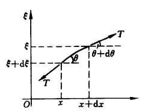

## 2023/9/20

### 1. Vibration of string 弦的振动

We assume that the string below has tension (张力) $T$ which is equal at every point on the string; the string is long enough so that $\theta \ll 1$ and $\xi \ll 1$.

Consider the part of string in the picture:

From Newton's Second Law of Motion-Force and Acceleration (牛顿第二定律), we know that $$(\lambda \mathrm dx) {\partial^2 \xi \over \partial t^2 } = T \sin(\theta + \mathrm d\theta) - T \sin \theta$$

Because $\theta \ll 1$, we can approximate $\sin \theta$ to $\tan \theta$, and we can get:

$$
\begin {align*}
(\lambda \mathrm dx) {\partial^2 \xi \over \partial t^2 } & = T \tan(\theta + \mathrm d\theta) - T \tan \theta \\
& = T \left( \left. {\partial \xi \over \partial x} \right \vert _{x+\mathrm dx} - \left. {\partial \xi \over \partial x} \right \vert _x \right)\\
& = T {\partial^2 \xi \over \partial x^2 } \mathrm dx
\end {align*}
$$

$$\lambda {\partial^2 \xi \over \partial t^2 } = T {\partial^2 \xi \over \partial x^2 }$$

And of course we can have $${\lambda \over T} {\partial^2 \xi \over \partial t^2 } - {\partial^2 \xi \over \partial x^2 } = 0.$$

The velocity of the wave is $$c = \sqrt{T \over \lambda},$$ and we can get $${1 \over c^2} {\partial^2 \xi \over \partial t^2 } - {\partial^2 \xi \over \partial x^2 } = 0.$$

The equation above is on one dimension only, and we can expand it to $${1 \over c^2} {\partial^2 \xi \over \partial t^2 } - \nabla ^2 \xi = 0,$$ which is $$\left ( {1 \over c^2} {\partial^2 \over \partial t^2 } - \nabla ^2 \right ) \xi = \Box \xi = 0.$$

### 2. Zero-Point Energy 零点能

#### (1) Simple Harmonic Oscillator 简谐振子

In classical mechanics we can have an SHO system, whose function can be written in the following ways:

- Newtonian Mechanics 牛顿力学

$$m \ddot x = -kx$$

$$\ddot x + {k \over m } x =0 $$

$$\ddot x + \omega^2 x =0, \ \omega=\sqrt{k \over m }.$$

- Theoretical Mechanics 理论力学

$$L=T-V = {1 \over 2}m \dot x^2-{1 \over 2}k x^2$$

$${\partial L \over \partial \dot x} = m \dot x$$

$${\partial L \over \partial x} = -kx$$

From $${\mathrm d \over \mathrm dt} {\partial L \over \partial \dot x}- {\partial L \over \partial x}=0,$$ we know that $${\mathrm d(m \dot x) \over \mathrm dt} - (-kx)=0, $$which is $$m \ddot x +kx = 0.$$

$$\ddot x + \omega^2 x =0, \ \omega=\sqrt{k \over m }.$$

#### (2) Calculation 计算零点能

Zero-point energy (ZPE) is the lowest possible energy that a quantum mechanical system may have.

Put the SHO system under quantum state (it becomes a **quantum harmonic oscillator** 量子谐振子), and we can get a minimum energy for it.

To calculate this "minimum energy", we start from Heisenberg Uncertainty Principle: $$\Delta x \cdot \Delta p \geq {\hbar \over 2}.$$

For the **lowest possible energy**, we need to have $$\Delta x \cdot \Delta p = {\hbar \over 2},$$ which means $$\Delta p = {\hbar \over 2 \Delta x }.$$

From energy $$E = \dfrac{p^2}{2m}+ U = \dfrac{p^2}{2m} + {1 \over 2} m \omega^2 x^2,$$ we can see that 
$$
\begin {align*}\Delta E & = \dfrac{(\Delta p)^2}{2m} + {1 \over 2} m \omega^2 (\Delta x)^2 \\
& = {{\left(\dfrac{\hbar}{ 2 \Delta x }\right)}^2 \over 2m} + {1 \over 2} m \omega^2 (\Delta x)^2 \\
& = {\hbar^2 \over 8m(\Delta x)^2} + {1 \over 2} m \omega^2 (\Delta x)^2 \\
& \geq 2 \sqrt{{\hbar^2 \over 8m(\Delta x)^2} \cdot {1 \over 2} m \omega^2 (\Delta x)^2} \\
& = {\hbar \omega \over 2},
\end {align*}
$$
where $=$ holds **if and only if** $${\hbar^2 \over 8m(\Delta x)^2} = {1 \over 2} m \omega^2 (\Delta x)^2, $$ that is, $$\Delta x = \sqrt{\hbar \over 2 m \omega}.$$

*有些学着很聪明，以为什么都懂，但是其实他只懂了30%。*
*有些学者看起来呆头呆脑，但是呆头呆脑的人做研究做得踏实，这才是我们真正需要的大聪明。*

### 3. Stationary Schrödinger Equation 定态薛定谔方程

We have the wave function $\Psi(x, t)$.

We can perform `separation of variables (分离变量)` to the function and have $$\Psi(x, t) = \Phi(x) \cdot \mathcal{T}(t).$$

From $$-{ \hbar^2 \over 2m }{\partial^2 \Psi(x, t) \over \partial x ^2 } + U \Psi(x, t) =\mathrm i\hbar {\partial \Psi(x, t) \over \partial t},$$ we can get $$-{ \hbar^2 \over 2m } \mathcal{T}(t){\mathrm d^2 \Phi(x) \over \mathrm d x ^2 } + U \Phi(x) \mathcal{T}(t) =\mathrm i\hbar \Phi(x) {\mathrm d \mathcal{T}(t) \over \mathrm d t}.$$

Put $\Phi$ and $x$ on one side, $\mathcal{T}$ and $t$ on the other, we can get $$\dfrac{-\dfrac{ \hbar^2 }{2m}\dfrac{\mathrm d^2 \Phi(x)}{\mathrm d x ^2 } + U \Phi(x) }{\Phi(x)} = \dfrac{\mathrm i\hbar \dfrac{\mathrm d \mathcal{T}(t) }{\mathrm d t}}{\mathcal{T}(t)}.$$

Because **All $\Phi$ and $x$ are on the left side and all $\mathcal{T}$ and $t$ are on the right**, this equation can only hold **if this equation is equal to a constant, that is,** $$\dfrac{-\dfrac{ \hbar^2 }{2m}\dfrac{\mathrm d^2 \Phi(x)}{\mathrm d x ^2 } + U \Phi(x) }{\Phi(x)} = \dfrac{\mathrm i\hbar \dfrac{\mathrm d \mathcal{T}(t) }{\mathrm d t}}{\mathcal{T}(t)}=\text{const}.$$

Perform dimensional analysis (量纲分析) on the equation above and we can see that the dimension of the constant is **energy** ($\mathrm{M^1L^2T^{-2}}$). 

Let this constant be $E$, and $E$ is called the **eigenenergy** (能量的本征值).

Look at the two parts separately:

#### (1) ${\mathcal{T}(t)}$

$$
\begin {align*}
\dfrac{\mathrm i\hbar \dfrac{\mathrm d \mathcal{T}(t) }{\mathrm d t}}{\mathcal{T}(t)} & =E \\[3ex]
\dfrac{\mathrm d \mathcal{T}(t) }{\mathcal{T}(t)} & = -{\mathrm iE \over \hbar}\mathrm dt \\[2ex]
\int {\dfrac{\mathrm d \mathcal{T}(t) }{\mathcal{T}(t)}} & = -{\mathrm iE \over \hbar} \int {\mathrm dt} \\[2ex]
\ln \mathcal{T}(t) & = -{\mathrm iE \over \hbar} t +C \\[2ex]
\mathrm e^{\ln \mathcal{T}(t)} & = \mathrm e^{-\frac{\mathrm iE }{\hbar} t +C} \\
\mathcal{T}(t) & = \mathcal{T}_0 \cdot \mathrm e^{-{\mathrm iE \over \hbar} t}\\
\end {align*}
$$

in which $C$ is the constant of integration (积分常数), and $\mathrm e^C = \mathcal{T}_0$.

#### (2) $\Phi(x)$

We can easily get this equation which does not include time $t$ in it: $$-\dfrac{ \hbar^2 }{2m}\dfrac{\mathrm d^2 \Phi(x)}{\mathrm d x ^2 } + U \Phi(x) =E\Phi(x),$$ which is called **Stationary Schrödinger Equation 定态薛定谔方程**.

Under the SHO case, $U=\dfrac{1}{2}m\omega^2x^2$, and we have $$-\dfrac{ \hbar^2 }{2m}\dfrac{\mathrm d^2 \Phi(x)}{\mathrm d x ^2 } + \dfrac{1}{2}m\omega^2x^2 \Phi(x) =E\Phi(x).$$
Its general solution is $$\Phi^*(x) = C \exp(-{\alpha \over 2} x^2).$$

Find the first and second order derivatives for $\Phi^*$:

$${\mathrm d\Phi^*(x) \over \mathrm dx} = -\alpha x\cdot C \exp(-{\alpha \over 2} x^2) = -\alpha x \cdot \Phi^*(x)$$

$${\mathrm d^2\Phi^*(x) \over \mathrm dx^2} = -\alpha (1-\alpha x^2) \cdot C \exp(-{\alpha \over 2} x^2) = -\alpha (1-\alpha x^2) \cdot \Phi^*(x)$$

And we have $$-\dfrac{ \hbar^2 }{2m}(-\alpha)(1-\alpha x^2)\cdot \Phi^*(x)+\dfrac{1}{2}m\omega^2x^2 \Phi^*(x)=E \Phi^*(x)$$

$$-\dfrac{ \hbar^2 }{2m}(-\alpha)(1-\alpha x^2)+\dfrac{1}{2}m\omega^2x^2 =E $$

$$\dfrac{\alpha \hbar^2 }{2m}(1-\alpha x^2) = E\left(1 - \dfrac{m\omega^2}{2E}x^2\right)$$

Compare the two forms and we know that 

$$
\left \{
\begin {array}{l}
\dfrac{\alpha \hbar^2 }{2m} = E \\[2ex]
\alpha = \dfrac{m\omega^2}{2E}
\end {array}
\right.
$$

And we get
$$
\left \{
\begin {array}{l}
E = \dfrac{\omega \hbar}{2} \\[2ex]
\alpha = \dfrac{m\omega}{\hbar}
\end {array}
\right.
$$
