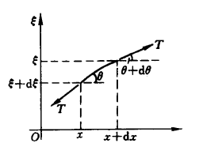

# 力学 赵亚溥老师 笔记

## 2023/9/11

### Introduction

**2022 Nobel Prize for Physics**: for experiments with entangled photons, establishing the violation of Bell inequalities and pioneering quantum information science

Three people won the prize: 
- Alain Aspect (France)
- John Clauser (the U.S.)
- Anton Zeilinger (Austria)

This brings about the problem of **`local realism (局部现实主义)`** and **`principle of locality (定域性原理)`**, which is believed true in CLASSICAL mechanics or electromagnetics.

> 作业：1. 思考：科学哲学上，“真实”是如何定义的？

### 1. Newtonian Mechanics, 1687 牛顿力学

In the *Principia* writes `the first Principle`: 

$$\overrightarrow F=\frac{\mathrm d \vec p} {\mathrm dt}$$

and Newton also gives `the Law of Universal Gravitation`:

$$ \overrightarrow F = -\frac{Gm_1m_2}{r^2} \hat {\vec r} $$


### 2. Some equations

- #### Navier-Stokes equations 纳维-斯托克斯方程
$$ {\partial \vec v \over \partial t} +(\vec v \cdot \overrightarrow V) \cdot \vec v = -{1 \over \rho} \overrightarrow \nabla p + \mu \nabla^2 \vec v + \vec g$$

- #### Euler-Lagrange equation 拉格朗日方程
$${\partial L \over \partial q_\alpha}-{\mathrm d \over \mathrm dt} {\partial L \over \partial \dot q_\alpha}=0, \ L=T-V$$

- #### Hamilton Canonical Equations 哈密顿正则方程
$$
\left \{
\begin{array} {l}
\dfrac{\partial H}{\partial p_\alpha}=\dot q_\alpha \\[3ex]
\dfrac{\partial H}{\partial q_\alpha}=-\dot p_\alpha
\end{array}
\right.
$$

### 3. Schrödinger Equation 薛定谔方程

$$-{ \hbar^2 \over 2m } \nabla ^2 \psi + U \psi =i\hbar {\partial \psi \over \partial t}$$ 

**Freeman Dyson: Four jokes by Nature**
- `the square root of minus one that the physicist Erwin Schrödinger put into his wave equation when he invented wave mechanics` 被放入薛定谔波函数的-1的平方根
- `the precise linearity of quantum mechanics, the fact that the possible states of any physical object form a linear space` 量子力学的精确线性，即物理对象的所有可能状态构成线性空间
- `the existence of quasi-crystals` 拟晶体的存在
- `a similarity in behavior between quasi-crystals and the zeros of the Riemann Zeta function` 拟晶体和黎曼$\zeta$函数在行为上的相似性


**Maxwell's equations 麦克斯韦方程组**

$$
\left \{
\begin{array} {c} 
\overrightarrow \nabla \cdot \overrightarrow E = \dfrac{\rho}{\varepsilon_0} \\[2ex]
\overrightarrow \nabla \cdot \overrightarrow B = 0 \\[2ex]
\overrightarrow \nabla \times \overrightarrow E = -\dfrac{\partial B}{\partial t} \\[2ex]
\overrightarrow \nabla \times \overrightarrow B = \mu_0(\vec j+\varepsilon_0 \dfrac{\partial \overrightarrow E}{ \partial t}) \\
\end{array} 
\right.
$$

### 4. General Relativity 广义相对论

**爱因斯坦引力场方程**

$$G_{\mu v}=R_{\mu v}-{1\over2}g_{\mu v}R=\frac{4\pi G}{c^4}T_{\mu v}$$

```
Matter tells space how to curve.
Curvature tells matter how to move.
```

### 5. Time reversal: A few examples 时间反演性的一些例子

$$t \mapsto -t$$
$$\vec r \mapsto \vec r$$
$$\vec v = {\mathrm d \vec r \over \mathrm dt} \mapsto -v$$
$$\vec a = {\mathrm d \vec v \over \mathrm dt} \mapsto a$$
$$\cdots$$
$$\overrightarrow {U_d} \mapsto -\overrightarrow {U_d} $$
$$\vec j \mapsto - \vec j$$
$$\overrightarrow B \mapsto - \overrightarrow B $$

#### (1) Lagrangian 拉格朗日量

CPT invariant: 
- C: `Charge Conjugation` 电荷共轭变换
- P: `Parity` 空间反射
- T: `Time Reversal` 时间反演

We can conclude from the Maxwell equations that the Lagrangian remains invariable under CPT changes.

#### (2) Schrödinger Equation 薛定谔方程

$$\psi(\vec r,t) \mapsto \psi(\vec r,-t) \ \ \ \ (*)$$
$$t \mapsto -t$$
$$\mathrm i \mapsto -\mathrm i$$

It can be seen that whether the Schrödinger equation remains unchanged under time reversal depends on $(*)$.

#### (3) Euler-Lagrange equation 拉格朗日方程
The equation is $${\mathrm d \over \mathrm dt} {\partial L \over \partial \dot q_\alpha}- {\partial L \over \partial q_\alpha}=0, \ L= T - V,$$ in which $q_\alpha$ is the **generalized coordinate** (广义坐标), and $\dot q_\alpha$ is its **generalized velocity** (广义速度).

> 作业：2. 推导哈密顿正则方程 
> $$
\left \{
\begin{array} {l}
\dfrac{\partial H}{\partial p_\alpha}=\dot q_\alpha \\[3ex]
\dfrac{\partial H}{\partial q_\alpha}=-\dot p_\alpha
\end{array}
\right.
> $$
> 的时间反演不变性。


### 6. Hamilton-Jacobian equation 哈密顿-雅可比方程

$$S= \int^{t_1}_{t_2} L \mathrm dt$$
$$ {\partial S \over \partial t}+H =0$$


## 2023/9/13 

### 1. Something about Hamilton Canonical Equations 关于哈密顿正则方程的一点讨论
The second equation can be derived to this form

$$\dot p_\alpha=-\dfrac{\partial H}{\partial q_\alpha}=-\dfrac{\partial (T+V)}{\partial q_\alpha}=-\dfrac{\partial V}{\partial q_\alpha},$$
in which $T=\dfrac{p_\alpha ^2} {2m}$ is independent of $q_\alpha$.

This is in accordance with $F(x) = -\dfrac{\mathrm dV(x) }{\mathrm dx}$ in Newtonian mechanics.

### 2. EPR paradox EPR详谬

> 作业1：什么是EPR paradox？

Albert Einstein VS N. Bohr: The Great Debate 玻尔和爱因斯坦论战

### 3. Something about quantum mechanics 关于量子力学的一点讨论

- In 1905, Einstein, in his famous `On the Electrodynamics of Moving Bodies (论动体的电动力学)` essay, pointed out two famous postulates (假设): `length compression 尺缩现象` and `time dilation 钟慢现象`.

- Heisenberg's Uncertainty Principle: 不确定性关系/测不准原理
<br>
e.q. 
$$\Delta x \cdot \Delta p_x \geq {\hbar \over 2}$$
$$\Delta E \cdot \Delta t \geq {\hbar \over 2}$$
$$\Delta \tau \cdot \Delta \theta \geq {\hbar \over 2}$$

- Occam's Razor: 奥卡姆剃刀原理
<br>
Entities should not be multiplied unnecessarily. 
如无必要，勿增实体。

### 4. Newtonianism VS Darwinism 牛顿主义和达尔文主义

- Newtonianism 牛顿主义: <br>
linear (线性的), simple (简洁的), superposable (空间可叠加的)

- Darwinism 达尔文主义: <br>
non-linear (非线性的), complex (复杂的), non-superposable (空间不可叠加的)

> 作业2：康德的“二律背反”是什么？

> 作业3：了解新冠肺炎和社会达尔文主义

### 5. About the Hamiltonian operator (哈密顿算子) $\nabla$

*Hamilton 23岁就当上了正教授！要学习他！*

The notation $\nabla$ is pronounced as `del`或`nabla`.

We define $\overrightarrow \nabla$ under three-dimensional Cartesian coordinate (三维笛卡尔坐标系), the base/unit vector (基矢/单位矢量) of three orthogonal (正交的) directions being $\hat i$, $\hat j$ and $\hat k$ (also sometimes written as $\vec e_x$, $\vec e_y$ and $\vec e_z$):

$$\overrightarrow \nabla= {\partial \over \partial x}\hat i + {\partial \over \partial y}\hat j + {\partial \over \partial z}\hat k$$

Do note that this Hamiltonian operator is not the same as the one by the same name in quantum mechanics (与量子力学中的哈密顿算符做区分), which, in quantum mechanics, is $$H= -{\hbar^2 \over 2m} \nabla^2 + U.$$

Then we can define: 
#### (1) Gradient 梯度

- The gradient of a scalar becomes a vector (essentially a first-order tensor) 对标量求梯度得到矢量（其实质为一阶张量）:
<br> $$\mathrm{grad} \ \phi = \overrightarrow \nabla \phi = {\partial \phi \over \partial x}\hat i + {\partial \phi \over \partial y}\hat j + {\partial \phi \over \partial z}\hat k$$
For example: $\overrightarrow F=-\overrightarrow \nabla U$

- The gradient of a vector becomes a second-order tensor 对矢量求梯度得到二阶张量:
<br> $$\mathrm{grad} \overrightarrow A = \overrightarrow \nabla \ \overrightarrow A = ({\partial \over \partial x_i}\hat i) \otimes (A_j \hat j) = {\partial A_j \over \partial x_i} (\hat i \otimes \hat j) = \begin{bmatrix}
\dfrac{\partial A_x}{\partial x} & \dfrac{\partial A_y}{\partial x} & \dfrac{\partial A_z}{\partial x} \\[3ex]
\dfrac{\partial A_x}{\partial y} & \dfrac{\partial A_y}{\partial y} & \dfrac{\partial A_z}{\partial y} \\[3ex]
\dfrac{\partial A_x}{\partial z} & \dfrac{\partial A_y}{\partial z} & \dfrac{\partial A_z}{\partial z} \\
\end{bmatrix}$$

Note: The equation above uses the `Einstein summation convention (爱因斯坦求和约定)`. For more reference about it, search online. 

#### (2) Divergence 散度

$$\mathrm{div} \overrightarrow A = \overrightarrow \nabla \cdot \overrightarrow A = {\partial A_x \over \partial x} + {\partial A_y \over \partial y} + {\partial A_z \over \partial z}$$

In its essence we are performing the act of the deduction of $\overrightarrow A$ ($\overrightarrow A$的降阶) when we calculate $\mathrm{div} \overrightarrow A$.

Note that we can only calculate the divergence of **vectors**, not **scalars**.

#### (3) Curl 旋度

$$\mathrm{curl} \overrightarrow A = \overrightarrow \nabla \times \overrightarrow A = \begin{vmatrix}
\hat i & \hat j & \hat k \\[1ex]
\dfrac{\partial}{\partial x} & \dfrac{\partial}{\partial y} & \dfrac{\partial}{\partial z} \\[2ex]
A_x & A_y & A_z \\
\end{vmatrix}$$


> 作业4：证明标量的梯度无旋、矢量的旋度无散

> 作业5：把Maxwell方程组写成分量形式


#### (4) Some practice 应用

In **field theory** (场论), we define $\vec r = x \hat i + y \hat j + z \hat k$.

##### ① $\vec r$ 的散度

$$\overrightarrow \nabla \cdot \vec r = ({\partial \over \partial x}\hat i + {\partial \over \partial y}\hat j + {\partial \over \partial z}\hat k) \cdot (x \hat i + y \hat j + z \hat k) = {\partial x \over \partial x} + {\partial y \over \partial y} + {\partial z \over \partial z} =3$$

##### ② The gravitational field 引力场

$$\overrightarrow \nabla r = \dfrac{\vec r}{|\vec r|} = \hat{\vec r}$$

In the gravitational field, we have $$U(r) = -{Gm_1m_2 \over r}.$$

Thus we have
$$\overrightarrow F = -\overrightarrow \nabla U = Gm_1m_2 \cdot \overrightarrow \nabla(\dfrac{1}{r}), $$
in which
$$\overrightarrow \nabla(\dfrac{1}{r})={-\overrightarrow \nabla r \over r^2}, $$
and consequently 
$$\overrightarrow F = - {G m_1 m_2 \over r^3}\vec r = - {G m_1 m_2 \over r^2} \hat {\vec r}.$$

##### ③ $\vec r$ 的梯度

$$\begin{align*}
\overrightarrow \nabla \vec r & = \overrightarrow \nabla \otimes \vec r \\
& = ({\partial \over \partial x}\hat i + {\partial \over \partial y}\hat j + {\partial \over \partial z}\hat k) \otimes (x \hat i + y \hat j + z \hat k) \\
& = {\partial x \over \partial x} (\hat i \otimes \hat i) + {\partial y \over \partial y}(\hat j \otimes \hat j) + {\partial z \over \partial z}(\hat k \otimes \hat k)\\
& = (\hat i \otimes \hat i) + (\hat j \otimes \hat j) + (\hat k \otimes \hat k) \\
& = \underline {\underline I} \\
& = \begin{bmatrix}
1 & 0 & 0 \\
0 & 1 & 0 \\
0 & 0 & 1 \\
\end{bmatrix} \\
\end{align*}$$

##### ④ The Laplacian operator 拉普拉斯算符

The Laplacian operator is linear. 拉普拉斯算符是线性算符。

Defined as: 

$$\nabla^2 = \Delta = \overrightarrow \nabla \cdot \overrightarrow \nabla = {\partial^2 \over \partial x^2} + {\partial^2 \over \partial y^2} + {\partial^2 \over \partial z^2}$$

For example, $$\nabla^2 r = \overrightarrow \nabla \cdot \overrightarrow \nabla r = \overrightarrow \nabla \cdot (\overrightarrow \nabla r) = {2 \over r}$$

> 作业6：推导上式

### 6. Discussion about some equations 关于公式的一些讨论

#### (1) Electromagnetic wave equations 电磁波方程
$$
\left \{
\begin{array} {l}
\left(\dfrac{1}{c^2} \dfrac{\partial^2}{\partial t^2}- \nabla^2\right)\overrightarrow E = \vec 0 \\[2ex]
\left(\dfrac{1}{c^2} \dfrac{\partial^2}{\partial t^2}- \nabla^2\right)\overrightarrow B = \vec 0 
\end{array}
\right.
$$
In this equation, $\Box$ 或 $\Box^2$ is called the d'Alembert or quabla operator (达朗贝尔算符), and $$\Box =\Box^2 = \dfrac{1}{c^2} \dfrac{\partial^2}{\partial t^2}- \nabla^2.$$

This set of equation is linear, because it is derived from the linear Maxwell equations.

#### (2) Navier-Stokes Equations 纳维-斯托克斯方程

$$\rho \left({\partial \vec v \over \partial t} + (\vec v \cdot \overrightarrow \nabla ) \vec v \right) = - \overrightarrow \nabla p+\underline{\mu\nabla^2\vec v}+ \rho \vec g$$

When $t \mapsto -t $, $\vec r \mapsto \vec r$, $\overrightarrow \nabla = \dfrac{\partial}{\partial r} \mapsto \overrightarrow \nabla$, $\vec v \mapsto -\vec v$. Consequently to make this equation right, the underlined part ($\mu\nabla^2\vec v$) shall be eliminated to make `Euler's equations`:
$$\rho \left({\partial \vec v \over \partial t} + (\vec v \cdot \overrightarrow \nabla ) \vec v \right) = - \overrightarrow \nabla p+ \rho \vec g$$

> 作业7：了解什么是第5种基本力 


## 2023/9/18

### 1. Heisenberg's Uncertainty Principle 海森堡不确定性原理

$$\Delta x \cdot \Delta p_x \geq {\hbar \over 2}$$
$$\Delta E \cdot \Delta t \geq {\hbar \over 2}$$
$$\Delta \tau \cdot \Delta \theta \geq {\hbar \over 2}$$

de Broglie: matter wave 物质波 (1926)

$$
\left \{
\begin {array}{l}
\vec p = \hbar \vec k \\[1ex]
E=\hbar \omega
\end{array}
\right.
$$

$[\hbar]$ is the dimension (量纲) of action (作用量) $S=\int_{t_1}^{t_2}L\mathrm dt$, and the three conjugations above is called `action conjugation 作用量共轭` .

In it $\vec k$ is the **wave vector (波矢)**, and it reflects the direction in which the wave propagates (传播). $k = \dfrac{2 \pi}{\lambda}$.

These equations reflects `wave-particle duality 波粒二象性` .

Two kinds of waves: 
- longitudinal wave 纵波
- transverse wave 横波

### 2. The derivation of Schrödinger Equation 薛定谔方程的推导

#### (1) Wave function 波函数 $\psi$
$$\psi = \mathrm e^{\mathrm i(\vec k \cdot \vec r - \omega t)} = \mathrm e^{\mathrm {i \over \hbar}(\vec p \cdot \vec r - E t)}$$

Because the wave function is an indication of probability, it must exists that $$\iiint _{(V)} |\psi|^2 \mathrm d\tau=1.$$

#### (2) The derivation of $\hat p$ 推导动量算符 $\hat p$
$$\overrightarrow \nabla \psi = {\partial \psi \over \partial \vec r} = {\mathrm i \over \hbar}\vec p \psi$$

$$\Rightarrow \vec p \psi = -\mathrm i \hbar \overrightarrow \nabla \psi$$

$$\Rightarrow \hat p = -\mathrm i \hbar \overrightarrow \nabla $$

From this we can see that momentum is linked with space (动量与空间相联系), and consequently, the conservation of momentum (动量守恒) is related to spatial translation invariance (空间平移不变性).

#### (3) The derivation of $\hat E$ 推导能量算符 $\hat E$

$${\partial \psi \over \partial t} = -{\mathrm i \over \hbar}E \psi$$

$$\Rightarrow E \psi = \mathrm i \hbar {\partial \over \partial t} \psi$$

$$\Rightarrow \hat E = \mathrm i \hbar {\partial \over \partial t} $$

From this we can see that energy is linked with time (能量与时间相联系), and consequently, the conservation of energy (能量守恒) is related to time translation invariance (时间平移不变性).

#### (4) The derivation of Schrödinger Equation 薛定谔方程的推导

$$H = E = {p^2 \over 2m} + U$$
Replace the quantities with operators, and we have
$$
\begin{align*}
\hat E & = {\hat p \cdot \hat p \over 2m} + \hat U \\[1em]
\mathrm i \hbar {\partial \over \partial t} & = {1 \over 2m} (-\mathrm i \hbar)^2 \nabla^2 + \hat U \\[1em]
\mathrm i \hbar {\partial \over \partial t} & = -{\hbar^2 \over 2m} \nabla^2 + \hat U 
\end{align*}
$$

Apply the equation above to $\psi$, and we have $$\mathrm i \hbar {\partial \psi \over \partial t} = -{\hbar^2 \over 2m} \nabla^2 \psi + \hat U \psi, $$

which is the Schrödinger Equation.

Sometimes we also write $E | \psi \rang =H|\psi \rang$.

> 作业1：重新推导一遍薛定谔方程


### 3. Principle of Superposition 叠加原理

Proposed by Daniel Bernoulli (son of John Bernoulli)

The Great Debate for String, 1730~1780:
Daniel Bernoulli, D'Alembert, Lagrange, Euler

D'Alembert, in 1747, proposed $\left(\dfrac{1}{c^2} \dfrac{\partial^2}{\partial t^2}- \nabla^2 \right) \vec u= \vec 0$, or $\Box \ \vec u = \vec 0$, or $\partial ^\mu \partial _\mu \vec u = g_{\mu\nu}\partial_\nu \partial _\mu \vec u = \vec 0 $.

John Bernoulli proposed `the discretization of string vibration 弦振动的离散化` , seeing the string as a string of beads (珠子). 

*赵爹评价为从-1到0的创举，并寄语我们：趁年轻干一票大的！*

> 作业2：推导弦振动方程（可用牛顿力学、理论力学方法）

### 4. Something about ... Well I don't know what it is about
|Velocity\Scale|Small Scale|Large Scale|
|:--:|--|--|
|High speed|$$(i \rlap{/}\partial - m) \psi = 0$$|Relativity<br>(Lorentz Transform)|
|Low speed|Quantum Mechanics$$\mathrm i \hbar {\partial \psi \over \partial t} = -{\hbar^2 \over 2m} \nabla^2 \psi + \hat U \psi$$|Classical Mechanics<br>(Galilean Transform)|

- Lorentz Transform 洛伦兹变换
$$
\left\{\begin{array}{l}
x'=\gamma (x-vt), \\
y'=y, \\
z'=z,\\
t'=\gamma (t-\dfrac{vx}{c^2}),
\end{array}
\right.
$$ 
in which 
$$\gamma=\dfrac{1}{\sqrt{1-\dfrac{v^2}{c^2}}}.$$

- Galilean Transform 伽利略变换
$$
\left\{
\begin{array}{l}
x'=x-vt \\
y'=y \\
z'=z\\
t'=t
\end{array}
\right.
$$

If $\dfrac{v}{c} \ll1$, $\gamma \approx 1$, and Lorentz Transform will be deducted to Galilean Transform.

Poincaré Group (庞加莱群) > Lorentz Group (洛伦兹群) > Galilean Group (洛伦兹群)

### 5. Four fundamental forces 4种基本力

*Dyson告诉我们，选择终极性课题，不要向火坑里面跳；
Einstein告诉我们，一个理论，要只发表一篇论文；
反思现在学术界________、________的行为和作风。*

#### (1) Universal gravity, 1687 万有引力

*人间：车行马走，柴米油盐*

*牛顿力学由天上产生，是一种哲学问题*
*~~友情推介：人间 - 王菲 (bushi)~~*

*1969 美国宇航员William Anders：“牛顿在驾驶飞船” VS 某某某 “星球飘在那里”*

The basic unit of gravity, `graviton (引力子)`, has not yet been found.

*牛津大学哲学系把牛顿划分为`instrumentalist (工具主义者)`，这不是一个贬义词，也是我们现在做研究的真实写照*

$$\overrightarrow F= m \ddot{\vec r}$$

Gravity → curvature; force → geometry

$$G_{\mu\nu} = {8 \pi G \over c^4} T_{\mu\nu}$$

```
Matter tells space how to curve.
Curvature tells matter how to move.
```

#### (2) Electromagnetic force, 1865 电磁相互作用 Maxwell

Force carriers: photons (光子)

#### (3) Strong interaction, 1973 强相互作用

Fine structure constant (精细结构常数): 
$$\alpha = {e^2 \over 4 \pi \varepsilon_0 \hbar c} \approx {1 \over 137.03599976} $$

#### (4) Weak interaction 弱相互作用

Pauli

Standard Model (SM, 标准模型): can conclude electromagnetic force, strong interaction and weak interaction.

#### (5) A fifth force? 第五种基本力

Dark energy, chameleons (变色龙), 非标准模型

Fermilab: g-2 model (about $\mu$ particles)

## 2023/9/20

### 1. Vibration of string 弦的振动

We assume that the string below has tension (张力) $T$ which is equal at every point on the string; the string is long enough so that $\theta \ll 1$ and $\xi \ll 1$.



Consider the part of string in the picture:

From Newton's Second Law of Motion-Force and Acceleration (牛顿第二定律), we know that $$(\lambda \mathrm dx) {\partial^2 \xi \over \partial t^2 } = T \sin(\theta + \mathrm d\theta) - T \sin \theta$$

Because $\theta \ll 1$, we can approximate $\sin \theta$ to $\tan \theta$, and we can get:

$$
\begin {align*}
(\lambda \mathrm dx) {\partial^2 \xi \over \partial t^2 } & = T \tan(\theta + \mathrm d\theta) - T \tan \theta \\
& = T \left( \left. {\partial \xi \over \partial x} \right \vert _{x+\mathrm dx} - \left. {\partial \xi \over \partial x} \right \vert _x \right)\\
& = T {\partial^2 \xi \over \partial x^2 } \mathrm dx
\end {align*}
$$

$$\lambda {\partial^2 \xi \over \partial t^2 } = T {\partial^2 \xi \over \partial x^2 }$$

And of course we can have $${\lambda \over T} {\partial^2 \xi \over \partial t^2 } - {\partial^2 \xi \over \partial x^2 } = 0.$$

The velocity of the wave is $$c = \sqrt{T \over \lambda},$$ and we can get $${1 \over c^2} {\partial^2 \xi \over \partial t^2 } - {\partial^2 \xi \over \partial x^2 } = 0.$$

The equation above is on one dimension only, and we can expand it to $${1 \over c^2} {\partial^2 \xi \over \partial t^2 } - \nabla ^2 \xi = 0,$$ which is $$\left ( {1 \over c^2} {\partial^2 \over \partial t^2 } - \nabla ^2 \right ) \xi = \Box \xi = 0.$$

### 2. Zero-Point Energy 零点能

#### (1) Simple Harmonic Oscillator 简谐振子

In classical mechanics we can have an SHO system, whose function can be written in the following ways:

- Newtonian Mechanics 牛顿力学

$$m \ddot x = -kx$$

$$\ddot x + {k \over m } x =0 $$

$$\ddot x + \omega^2 x =0, \ \omega=\sqrt{k \over m }.$$


- Theoretical Mechanics 理论力学

$$L=T-V = {1 \over 2}m \dot x^2-{1 \over 2}k x^2$$

$${\partial L \over \partial \dot x} = m \dot x$$

$${\partial L \over \partial x} = -kx$$

From $${\mathrm d \over \mathrm dt} {\partial L \over \partial \dot x}- {\partial L \over \partial x}=0,$$ we know that $${\mathrm d(m \dot x) \over \mathrm dt} - (-kx)=0, $$which is $$m \ddot x +kx = 0.$$

$$\ddot x + \omega^2 x =0, \ \omega=\sqrt{k \over m }.$$

#### (2) Calculation 计算零点能

Zero-point energy (ZPE) is the lowest possible energy that a quantum mechanical system may have.

Put the SHO system under quantum state (it becomes a **quantum harmonic oscillator** 量子谐振子), and we can get a minimum energy for it.

To calculate this "minimum energy", we start from Heisenberg Uncertainty Principle: $$\Delta x \cdot \Delta p \geq {\hbar \over 2}.$$

For the **lowest possible energy**, we need to have $$\Delta x \cdot \Delta p = {\hbar \over 2},$$ which means $$\Delta p = {\hbar \over 2 \Delta x }.$$

From energy $$E = \dfrac{p^2}{2m}+ U = \dfrac{p^2}{2m} + {1 \over 2} m \omega^2 x^2,$$ we can see that 
$$
\begin {align*}\Delta E & = \dfrac{(\Delta p)^2}{2m} + {1 \over 2} m \omega^2 (\Delta x)^2 \\
& = {{\left(\dfrac{\hbar}{ 2 \Delta x }\right)}^2 \over 2m} + {1 \over 2} m \omega^2 (\Delta x)^2 \\
& = {\hbar^2 \over 8m(\Delta x)^2} + {1 \over 2} m \omega^2 (\Delta x)^2 \\
& \geq 2 \sqrt{{\hbar^2 \over 8m(\Delta x)^2} \cdot {1 \over 2} m \omega^2 (\Delta x)^2} \\
& = {\hbar \omega \over 2},
\end {align*}
$$
where $=$ holds **if and only if** $${\hbar^2 \over 8m(\Delta x)^2} = {1 \over 2} m \omega^2 (\Delta x)^2, $$ that is, $$\Delta x = \sqrt{\hbar \over 2 m \omega}.$$

*有些学着很聪明，以为什么都懂，但是其实他只懂了30%。*
*有些学者看起来呆头呆脑，但是呆头呆脑的人做研究做得踏实，这才是我们真正需要的大聪明。*

### 3. Stationary Schrödinger Equation 定态薛定谔方程

We have the wave function $\Psi(x, t)$.

We can perform `separation of variables (分离变量)` to the function and have $$\Psi(x, t) = \Phi(x) \cdot \mathcal{T}(t).$$

From $$-{ \hbar^2 \over 2m }{\partial^2 \Psi(x, t) \over \partial x ^2 } + U \Psi(x, t) =\mathrm i\hbar {\partial \Psi(x, t) \over \partial t},$$ we can get $$-{ \hbar^2 \over 2m } \mathcal{T}(t){\mathrm d^2 \Phi(x) \over \mathrm d x ^2 } + U \Phi(x) \mathcal{T}(t) =\mathrm i\hbar \Phi(x) {\mathrm d \mathcal{T}(t) \over \mathrm d t}.$$

Put $\Phi$ and $x$ on one side, $\mathcal{T}$ and $t$ on the other, we can get $$\dfrac{-\dfrac{ \hbar^2 }{2m}\dfrac{\mathrm d^2 \Phi(x)}{\mathrm d x ^2 } + U \Phi(x) }{\Phi(x)} = \dfrac{\mathrm i\hbar \dfrac{\mathrm d \mathcal{T}(t) }{\mathrm d t}}{\mathcal{T}(t)}.$$

Because **All $\Phi$ and $x$ are on the left side and all $\mathcal{T}$ and $t$ are on the right**, this equation can only hold **if this equation is equal to a constant, that is,** $$\dfrac{-\dfrac{ \hbar^2 }{2m}\dfrac{\mathrm d^2 \Phi(x)}{\mathrm d x ^2 } + U \Phi(x) }{\Phi(x)} = \dfrac{\mathrm i\hbar \dfrac{\mathrm d \mathcal{T}(t) }{\mathrm d t}}{\mathcal{T}(t)}=\text{const}.$$

Perform dimensional analysis (量纲分析) on the equation above and we can see that the dimension of the constant is **energy** ($\mathrm{M^1L^2T^{-2}}$). 

Let this constant be $E$, and $E$ is called the **eigenenergy** (能量的本征值).

Look at the two parts separately:

#### (1) ${\mathcal{T}(t)}$

$$
\begin {align*}
\dfrac{\mathrm i\hbar \dfrac{\mathrm d \mathcal{T}(t) }{\mathrm d t}}{\mathcal{T}(t)} & =E \\[3ex]
\dfrac{\mathrm d \mathcal{T}(t) }{\mathcal{T}(t)} & = -{\mathrm iE \over \hbar}\mathrm dt \\[2ex]
\int {\dfrac{\mathrm d \mathcal{T}(t) }{\mathcal{T}(t)}} & = -{\mathrm iE \over \hbar} \int {\mathrm dt} \\[2ex]
\ln \mathcal{T}(t) & = -{\mathrm iE \over \hbar} t +C \\[2ex]
\mathrm e^{\ln \mathcal{T}(t)} & = \mathrm e^{-\frac{\mathrm iE }{\hbar} t +C} \\
\mathcal{T}(t) & = \mathcal{T}_0 \cdot \mathrm e^{-{\mathrm iE \over \hbar} t}\\
\end {align*}
$$

in which $C$ is the constant of integration (积分常数), and $\mathrm e^C = \mathcal{T}_0$.

#### (2) $\Phi(x)$

We can easily get this equation which does not include time $t$ in it: $$-\dfrac{ \hbar^2 }{2m}\dfrac{\mathrm d^2 \Phi(x)}{\mathrm d x ^2 } + U \Phi(x) =E\Phi(x),$$ which is called **Stationary Schrödinger Equation 定态薛定谔方程**.

Under the SHO case, $U=\dfrac{1}{2}m\omega^2x^2$, and we have $$-\dfrac{ \hbar^2 }{2m}\dfrac{\mathrm d^2 \Phi(x)}{\mathrm d x ^2 } + \dfrac{1}{2}m\omega^2x^2 \Phi(x) =E\Phi(x).$$
Its general solution is $$\Phi^*(x) = C \exp(-{\alpha \over 2} x^2).$$

Find the first and second order derivatives for $\Phi^*$:

$${\mathrm d\Phi^*(x) \over \mathrm dx} = -\alpha x\cdot C \exp(-{\alpha \over 2} x^2) = -\alpha x \cdot \Phi^*(x)$$

$${\mathrm d^2\Phi^*(x) \over \mathrm dx^2} = -\alpha (1-\alpha x^2) \cdot C \exp(-{\alpha \over 2} x^2) = -\alpha (1-\alpha x^2) \cdot \Phi^*(x)$$

And we have $$-\dfrac{ \hbar^2 }{2m}(-\alpha)(1-\alpha x^2)\cdot \Phi^*(x)+\dfrac{1}{2}m\omega^2x^2 \Phi^*(x)=E \Phi^*(x)$$

$$-\dfrac{ \hbar^2 }{2m}(-\alpha)(1-\alpha x^2)+\dfrac{1}{2}m\omega^2x^2 =E $$

$$\dfrac{\alpha \hbar^2 }{2m}(1-\alpha x^2) = E\left(1 - \dfrac{m\omega^2}{2E}x^2\right)$$

Compare the two forms and we know that 

$$
\left \{
\begin {array}{l}
\dfrac{\alpha \hbar^2 }{2m} = E \\[2ex]
\alpha = \dfrac{m\omega^2}{2E}
\end {array}
\right.
$$

And we get
$$
\left \{
\begin {array}{l}
E = \dfrac{\omega \hbar}{2} \\[2ex]
\alpha = \dfrac{m\omega}{\hbar}
\end {array}
\right.
$$

## 2023/9/25

### 1. Gravity and gravitational potential 引力和引力势

$$U = - {GMm \over r}$$

$$\overrightarrow F(\vec r) = - \overrightarrow \nabla U = - {GMm \over r^2} \hat {\vec r}$$

*为什么有$r^2$项？因为场是点源产生的球面场，场对应的力有$r^2$形式。*

We can get $U(r_0)$ from $\overrightarrow F(\vec r)$:

$$U(r_0) = \int^{+\infin}_{r_0} -{GMm \over r^2} \mathrm dr = \left.{GMm \over r} \right|^{+\infin}_{r_0} = -{GMm \over r_0}$$

Near the ground of earth, at height $h(h \ll R)$, we can have approximately $U=mgh$. That's because 

$$
\begin{align*}
U(R+h)- U(R) & = {GMm \over R} - {GMm \over R+h} \\[2ex]
& = GMm \cdot {h \over R(R+h)} \\[2ex]
& \approx {GMmh \over r^2} \\[2ex]
& = mgh.
\end{align*}
$$


### 2. The Great Debate for String, 1730~1780:
- Daniel Bernoulli: the first to propose a partial differential equation 第一个提出偏微分方程的人
- D'Alembert: superposition principle 叠加原理
- Lagrange
- Euler

John Bernoulli: `the discretization of string vibration 弦振动的离散化` , which sees the string as a string of beads (珠子). 

### 3. Gauss 高斯

*The three most renowned mathematicians: Archimedes 阿基米德, Isaac Newton 伊萨克·牛顿, and **Gauss** 高斯.*

#### (1) Gauss's theorem (electromagnetics) 高斯定理

Differential form 微分形式: 

$$\overrightarrow \nabla \cdot \overrightarrow E = {\rho \over \varepsilon_0}, $$

or integral form 积分形式: 

$$\iint_{\partial V}\!\!\!\!\!\!\!\!\!\!\!\!\bigcirc \ \ \overrightarrow E \cdot \mathrm d \overrightarrow S = {Q_{\mathrm{enc}} \over \varepsilon_0},$$

in which $\mathrm {enc} $ stands for **enclosed**.

## 2023/9/25

### 1. Gravity and gravitational potential 引力和引力势

$$U = - {GMm \over r}$$

$$\overrightarrow F(\vec r) = - \overrightarrow \nabla U = - {GMm \over r^2} \hat {\vec r}$$

*为什么有$r^2$项？因为场是点源产生的球面场，场对应的力有$r^2$形式。*

We can get $U(r_0)$ from $\overrightarrow F(\vec r)$:

$$U(r_0) = \int^{+\infin}_{r_0} -{GMm \over r^2} \mathrm dr = \left.{GMm \over r} \right|^{+\infin}_{r_0} = -{GMm \over r_0}$$

Near the ground of earth, at height $h(h \ll R)$, we can have approximately $U=mgh$. That's because 

$$
\begin{align*}
U(R+h)- U(R) & = {GMm \over R} - {GMm \over R+h} \\[2ex]
& = GMm \cdot {h \over R(R+h)} \\[2ex]
& \approx {GMmh \over r^2} \\[2ex]
& = mgh.
\end{align*}
$$


### 2. The Great Debate for String, 1730~1780:
- Daniel Bernoulli: the first to propose a partial differential equation 第一个提出偏微分方程的人
- D'Alembert: superposition principle 叠加原理
- Lagrange
- Euler

John Bernoulli: `the discretization of string vibration 弦振动的离散化` , which sees the string as a string of beads (珠子). 

### 3. Gauss 高斯

*The three most renowned mathematicians: Archimedes 阿基米德, Isaac Newton 伊萨克·牛顿, and **Gauss** 高斯.*

#### (1) Gauss's theorem (electromagnetics) 高斯定理

Differential form 微分形式: 

$$\overrightarrow \nabla \cdot \overrightarrow E = {\rho \over \varepsilon_0}, $$

or integral form 积分形式: 

$$\iint_{\partial V}\!\!\!\!\!\!\!\!\!\!\!\!\bigcirc \ \ \overrightarrow E \cdot \mathrm d \overrightarrow S = {Q_{\mathrm{enc}} \over \varepsilon_0},$$

in which $\mathrm {enc} $ stands for **enclosed**.

Flux 通量: In vector calculus flux is a scalar quantity, defined as the surface integral of the perpendicular component of a vector field over a surface. 单位面积、单位时间通过某个面的量

$$\overrightarrow \nabla \cdot \overrightarrow E = \mu_0(\vec j + \varepsilon_0 {\partial \overrightarrow E \over \partial t})$$

$$\overrightarrow \nabla \cdot (\overrightarrow \nabla \times \overrightarrow E ) = 0 \ \mathsf{(旋度无散)}$$


Electric density conservation 电荷密度守恒定律 (?): 
$${\partial \rho \over \partial t} + \overrightarrow \nabla \cdot \overrightarrow J = {\partial \rho \over \partial t}+\overrightarrow \nabla \cdot (\rho \vec v) = 0$$

#### (2) Gauss's law of gravity 引力场的高斯定理

Differential form 微分形式: 

$$\overrightarrow \nabla \cdot \vec g = -4 \pi G \rho \ \ (\rho = {M_{\mathrm{enc}} \over V}),$$

or integral form 积分形式: 

$$\iint_{\partial V}\!\!\!\!\!\!\!\!\!\!\!\!\bigcirc \ \ \ \vec g \cdot \mathrm d \overrightarrow S = -4 \pi G M_{\mathrm{enc}},$$

where $$\vec g = - {GM \over r^2} \hat {\vec r}.$$

This can be derived in the following way:

$$\iint_{\partial V}\!\!\!\!\!\!\!\!\!\!\!\!\bigcirc \ \ \ {GMm \over r^2} \hat {\vec r} \cdot \mathrm d \overrightarrow S = GMm \iint_{\partial V}\!\!\!\!\!\!\!\!\!\!\!\!\bigcirc \ \ \ {\mathrm d S_\perp \over r^2} = 4 \pi GMm,$$

where $$\iint_{\partial V}\!\!\!\!\!\!\!\!\!\!\!\!\bigcirc \ \ \ {\mathrm d S_\perp \over r^2} = \iint_{\partial V}\!\!\!\!\!\!\!\!\!\!\!\!\bigcirc \ \ \ \mathrm d \Omega = 4 \pi, $$

and $\Omega$ is a solid angle (立体角).

Because gravity is a conservative force, $$\overrightarrow \nabla \times \vec g = \vec 0.$$

When $$\vec g = - \overrightarrow \nabla \varphi,$$ where $\varphi$ is the gravitational potential.

Associate it with the differential form of Gauss's law of gravity, and  we get $$\nabla ^2 \varphi = 4 \pi G \rho,$$ which is called the **Poisson's equation (泊松方程) for gravitational potential**.

Note: when a certain potential $\varphi$ has $$\nabla ^2 \varphi = 0$$, we call this equation a **Laplace's equation**. If $$\nabla ^2 \varphi \neq 0$$, we call it a **Poisson's equation**. 

#### (3) Gauss's divergence theorem 高斯散度定理

$$\iiint \overrightarrow \nabla \cdot \overrightarrow F \mathrm dV = \iint_{\partial V}\!\!\!\!\!\!\!\!\!\!\!\!\bigcirc \ \ \ \overrightarrow F \cdot \mathrm d \overrightarrow S$$

The definition of divergence (散度) of a vector $\overrightarrow A$ in mathematics:

$$\overrightarrow \nabla \cdot \overrightarrow A = \lim _{V \rightarrow0}\left({1 \over V}\iint_{\partial V}\!\!\!\!\!\!\!\!\!\!\!\!\bigcirc \ \ \overrightarrow A \cdot \mathrm d \overrightarrow S\right)$$


### 4. Black holes, 1968 黑洞

singularity 寄点

Roger Penrose: 2020 Nobel Prize for Physics

From $$ {1 \over 2} mv_2^2-{GMm \over R} = 0,$$ in which $R$ is the boundary of a globe (i.e. the Earth; the universe), and we have $$v_2 =\sqrt{2GM \over R}.$$

In 1784 and 1796 respectively, John Michell and Pierre-Simon Laplace proposed that when $v_2 = c$, we can get the Schwarzchild radius: $$R = r_s = {2GM \over c^2},$$ which, by incident, is completely in correspondence with the result Schwarzchild got using general relativity (广义相对论).

To calculate the boundary of the universe, let $$r_s = {2GM_{\mathrm {universe}} \over c^2} = {2G \over c^2} \cdot {4 \over 3} \pi \rho r_s^3,$$ in which $\rho \approx 10^{-29} \mathrm{g/cm^3}$ is the average density of the universe.

$$r_s = \sqrt{3c^2 \over 8 \pi G \rho} \approx 10^{26} \mathrm m.$$
