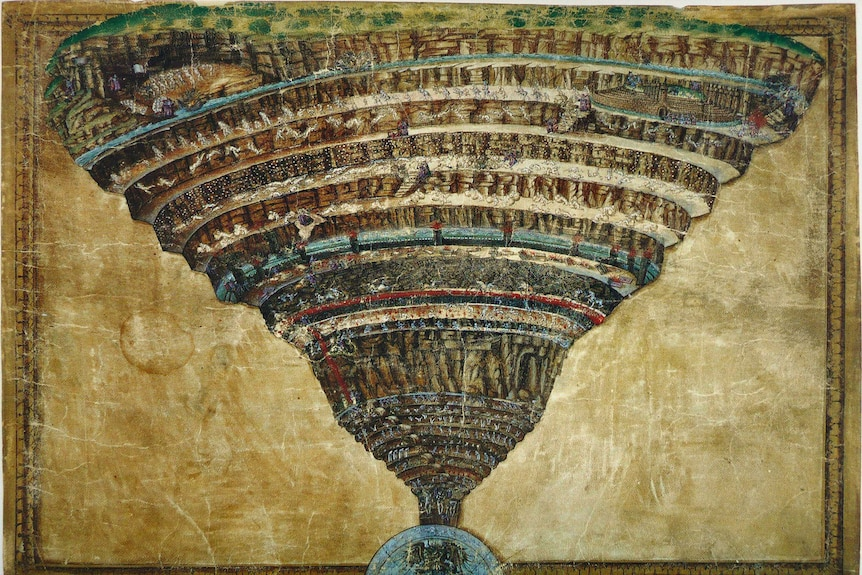
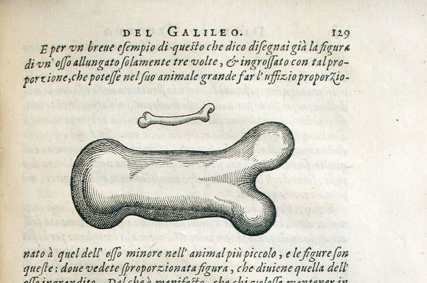

## 2023/11/08

***划重点！划重点！***
***本次课上，赵爹披露重大新闻，引起全班轰动！***

***据悉，赵爹被剑桥大学出版社请了四次，将《力学讲义》译成英文出版！！他没有去！！***

### 1. Galilean invariance 伽利略不变性

#### (1) Basic forms

The basic foundation of Galilean invariance is

$$
\left\{
\begin{array}{l}
\boldsymbol r' = \boldsymbol r - \boldsymbol Vt \\
t' = t
\end{array}
\right.
$$

where $\boldsymbol V$ is a constant vector (常矢量).

According to this foundation, we can know:

$${\partial \over \partial t} = {\partial \over \partial t'}{\partial t' \over \partial t} + {\partial \over \partial \boldsymbol r'}{\partial \boldsymbol r' \over \partial t} = {\partial \over \partial t'} - \boldsymbol V \cdot \nabla'$$

$${\partial \over \partial \boldsymbol r} = \nabla = {\partial \over \partial \boldsymbol r'}{\partial \boldsymbol r' \over \partial \boldsymbol r} = \nabla' \cdot \mathbf I = \nabla'$$

#### (2) Three principal invariants of second-order tensors 二阶张量的三个主不变量

> *此话题似乎由“菜鸡不啄天堂米”指出的赵爹的一个拼写错误引起，和上下文没有大的关系。*
>
> *译者另附表格：*
>
> | Word | Definition |
> | ----- | ----- |
> | invariant | *n.* 不变量; *adj.* 不变的
> | invariance | *n.* 不变性 | 
>
> *希望大家不要拼错。*

Suppose we have a matrix

$$\mathbf A = 
\begin{bmatrix}
A_{11} & A_{12} &A_{13} \\
A_{21} & A_{22} &A_{23} \\
A_{31} & A_{32} &A_{33}
\end{bmatrix}
$$

If $\mathbf A \cdot \boldsymbol v = \lambda \boldsymbol v$, then we call $\boldsymbol v$ the **eigenvector (特征矢量，本征矢量)** of the linear transformation $\mathbf A$, and $\lambda$ the **eigenvalue (特征值，本征值)** of $\mathbf A$.

From this, we have

$$\mathbf A \cdot \boldsymbol v - \lambda \boldsymbol v = \boldsymbol 0$$

and thus

$$(\mathbf A - \lambda \mathbf e) \cdot \boldsymbol v = \boldsymbol 0,$$

which is a homogeneous (齐次的) equation. In order for this equation to have a non-trivial solution (非平凡解), we need to have

$$\det (\mathbf A - \lambda \mathbf e) = 0.$$

That is, 

$$
\begin{vmatrix}
A_{11} - \lambda & A_{12} & A_{13} \\
A_{21} & A_{22} - \lambda & A_{23} \\
A_{31} & A_{32} & A_{33} - \lambda 
\end{vmatrix} = 0
$$

$$
\begin{align*}
(A_{11} - \lambda)(A_{22} - \lambda)(A_{33} - \lambda) + A_{12}A_{23}A_{31} + A_{13}A_{21}A_{32} & \\ - (A_{11} - \lambda)A_{23}A_{32} - A_{13}(A_{22} - \lambda)A_{31} - A_{12}A_{21}(A_{33} - \lambda) & = 0
\end{align*}
$$

Arrange this formula, and we get

$$\lambda ^3 - I_1 \lambda ^2 + I_2 \lambda - I_3 = 0,$$

in which

$$
\begin{align*}
I_1 & = \operatorname{tr} \mathbf{A} = A_{11} + A_{22} + A_{33} = \lambda_1 + \lambda_2 + \lambda_3, \\
I_2 & = \frac{1}{2} \left[ (\operatorname{tr} \mathbf{A})^2 - \operatorname{tr} \left( \mathbf{A}^2 \right) \right] \\[2ex]
& = A_{11} A_{22} + A_{22} A_{33} + A_{11} A_{33} - A_{12} A_{21} - A_{23} A_{32} - A_{13} A_{31} \\ & = \lambda_1 \lambda_2 + \lambda_1 \lambda_3 + \lambda_2 \lambda_3, \\
I_3 & = \det (\mathbf{A}) \\ & = - A_{13} A_{22} A_{31} + A_{12} A_{23} A_{31} + A_{13} A_{21} A_{32} \\ & \quad - A_{11} A_{23} A_{32} - A_{12} A_{21} A_{33} +   A_{11} A_{22} A_{33} \\ & = \lambda_1 \lambda_2 \lambda_3.
\end{align*}
$$

#### (3) The Galilean Invariance in the Navier-Stokes equations 纳维-斯托克斯方程的伽利略不变性

$$ {\partial \boldsymbol v \over \partial t} +(\boldsymbol v \cdot \nabla) \boldsymbol v = - {1 \over \rho} \nabla p + \mu \nabla^2 \boldsymbol v + \boldsymbol g$$

Put it in a Galilean transformation, and we can get

$$
\begin{align*}
\text{LHS} & = \left( {\partial \over \partial t'} - \boldsymbol V \cdot \nabla' \right)(\boldsymbol v' + \boldsymbol V) + [(\boldsymbol v' + \boldsymbol V) \cdot \nabla'](\boldsymbol v' + \boldsymbol V) \\[2ex]
& = {\partial \boldsymbol v' \over \partial t} + \boldsymbol 0 - (\boldsymbol V \cdot \nabla') \boldsymbol v' - \boldsymbol 0 + (\boldsymbol v' \cdot \nabla') \boldsymbol v' + (\boldsymbol V \cdot \nabla') \boldsymbol v' \\[2ex]
& = {\partial \boldsymbol v' \over \partial t} + (\boldsymbol v' \cdot \nabla') \boldsymbol v' \\[2ex]
\text{RHS} & = - {1 \over \rho} \nabla' \left( p + {1 \over 2} \rho V^2 \right) + \mu \nabla'^2 (\boldsymbol v' + \boldsymbol V) + \boldsymbol g \\[2ex]
& = - {1 \over \rho} \nabla' p + \mu \nabla'^2 \boldsymbol v' + \boldsymbol g \\[2ex]
\end{align*}
$$

When $\boldsymbol g$ conforms to the Galilean invariance, the Navier-Stokes equations shall conform to the Galilean invariance.

### 2. Square-Cube law (1638) 平方-立方定律

Take $L$ as the characteristic value (特征尺度), and the area $A \sim L^2$, whereas the volume $V \sim L^3$, proportional to the weight. Consequently, we have

$${V \over A} \sim L$$

In his twenties, Galileo was asked to calculate hell's exact dimensions, based on Dante's description. Below is an excerpt from [*Galileo, Dante Alighieri, and how to calculate the dimensions of hell* (https://www.abc.net.au/listen/programs/ockhamsrazor/galileo-mapped-dimensions-dante-inferno-hell/7164468)](https://www.abc.net.au/listen/programs/ockhamsrazor/galileo-mapped-dimensions-dante-inferno-hell/7164468):

> *When a young Galileo Galilei was approached to calculate the exact dimensions of hell, he got it all wrong. Len Fisher explains how this mistake—and Galileo's subsequent correction—helped establish the foundations of modern science.*
>
> Dante Alighieri imagined hell as being a hole in the Earth the shape of a giant ice cream cone.
>
> With a tip at the centre of the Earth, hell was covered by a vaulted roof that was part of the Earth's surface—a layer of chocolate on top of the ice cream.
>
> Galileo was asking for it—and he got it, in the form of house arrest for the rest of his life.
>
> The space below the roof was divided into nine levels, with the deepest reserved for the worst sinners.
>
> The academic and church establishments of 14th century Italy took Dante's picture of hell literally.
>
> The Florentine academy even asked a young polymath called Galileo Galilei to calculate its exact dimensions, based on Dante's description.
>
> It was a great opportunity for the 24-year-old, and he set to work with a will.
>
> We still have the transcripts of the two lectures Galileo gave announcing his results. They are well worth a read, and far clearer than a lot of today's scientific papers.
>
> They also turned out to be a stark warning: the literal interpretation of a piece of poetic imagery can lead to the most absurd results.
>
> Galileo's first job was to work out just how wide the vaulted roof of hell might be. He knew that the centre of the roof lay in Jerusalem, because Dante had said so in his description of the journey into Purgatory:
>
> > *Already the Sun was joined to the horizon*
> >
> > *Whose meridian circle covers*
> >
> > *Jerusalem with its highest point*
>
> 
>
> But how wide was this meridian circle? How big was the ice cream?
>
> In order to prove that Dante's description of the Sun being 'joined to the horizon' was true, Galileo took the poetry to mean that the diameter of hell's circle must be equal to the radius of the Earth.
>
> This meant that the boundary of the roof would pass through Marseille in France on the western side and through Tashkent in modern-day Uzbekistan on the east.
>
> That makes the roof of hell a pretty big dome—but then, it had to be to accommodate the present and future inhabitants.
>
> Galileo's next problem was to work out just how thick the roof would have to be to stop it collapsing and crushing the captives beneath.
>
> At this point he had another bright idea. Galileo knew that Brunelleschi's famous Duomo in Florence—which is still standing today—was 45 metres wide but only three metres thick.
>
> By scaling this up, he worked out that the roof of hell would have to be 600 kilometres thick. Galileo eventually realised that this figure was the product of a fatal error in his calculations. But by the time he noticed, his erroneous mathematical picture of hell had landed him a job as a lecturer in mathematics at the University of Pisa.
>
> Rather than admit his error and perhaps lose his prestigious position, Galileo kept his mouth firmly shut and continued to ponder the correct solution.
>
> He didn't keep his mouth shut about other things, though. The story of how Galileo came to publicly oppose the Church's view that the Earth is the centre of the universe is well-known, as is the fact that it landed him in serious trouble.
>
> Galileo made another mistake when he published his ideas about a heliocentric universe in his *Dialogue Concerning the Two Chief World Systems*.
>
> It was cast in the form of a discussion between a character called Salviati (this was Galileo himself), an intelligent layman called Sagredo (representing the sort of person who might these days listen to RN) and a dull-witted respondent called Simplicio, whose unthinking opinions Galileo was concerned with squashing.
>
> Galileo wasn't completely without political wiles, and he accepted the directive of the church authorities to describe his heliocentric notions as a 'hypothesis', and to incorporate the opinions of the pope in his dialogue.
>
> His mistake was to put the pope's opinions into the mouth of Simplicio. Galileo was asking for it—and he got it, in the form of house arrest for the rest of his life.
>
> While confined, Galileo wrote his other famous book, called *Dialogues Concerning Two New Sciences*.
>
> Here, he returned to the problem of hell and finally admitted publicly to his second-biggest mistake—the thickness of hell's domed roof.
>
> Galileo, you see, had originally assumed that the width and the thickness of the roof could both be scaled up in the same way—when the width doubled, he thought, the thickness would also need to be doubled.
>
> It made sense at the time, but he now admitted that he was wrong: the thickness would have to increase faster than the width to maintain the strength of the structure.
>
> The rule he worked out was that the cube of the thickness divided by the square of the span needed to be kept constant.
>
> This is known as Galileo's square-cube law, and it is still used by engineers today. It shows that objects like beams and roofs need to become disproportionately thicker as they become larger if they are to maintain their strength.
>
> It even applies to animal bones, and explains why there is a limit to the size of animals, since above a certain size their bones would have to be impossibly thick.
>
> It also applies to hell. When Galileo repeated his calculations using the square-cube law, he found that the roof would have to be so thick that there would hardly be any room underneath to accommodate all those dead souls.
>
> He didn't tell anyone. It might have cost him his reputation and his job. Only at the end of his life, when he was under house arrest, did he write it all down.
>
> He turned the problem of hell and its dimensions into one of the foundations of modern science and engineering.
>
> In doing so, Galileo established an approach to science that has held sway to this day—that of stubbornly checking out your beliefs against reality.
>
> Speaking of reality: the very existence of hell is, of course, still a bone of contention in some quarters (although if we use Galileo's square-cube law, there is a limit to the size that bone can attain).
>
> 

### 3. Virial Theorem 位力定理

*杨振宁：不会凑就不要做理论物理研究*

$$K = \sum_i {1 \over 2}m_i v_i^2 = \sum_i {1 \over 2}m_i \boldsymbol v_i \cdot \boldsymbol v_i$$

$$
\begin{align*}
{\partial K \over \partial \boldsymbol v} & = \sum_i {1 \over 2} m_i {\partial \over \partial \boldsymbol v}(\boldsymbol v_i \cdot \boldsymbol v_i) \\ & = \sum_i {1 \over 2} m_i (\mathbf I \cdot \boldsymbol v_i + \boldsymbol v_i \cdot \mathbf I) \\ & = \sum_i {1 \over 2} m_i \cdot 2 \boldsymbol v_i \\ & = \sum_i m_i \boldsymbol v_i \\ & = \boldsymbol p
\end{align*}
$$

$$
\begin{align*}
2K & = \sum_i m_i \boldsymbol v_i \cdot \boldsymbol v_i \\ & = \sum_i \boldsymbol p_i \cdot \boldsymbol v_i \\ & = \sum_i \boldsymbol p_i \cdot {\mathrm d \boldsymbol r_i \over \mathrm dt} \\ & = {\mathrm d \over \mathrm dt} \sum_i \boldsymbol p_i \cdot \boldsymbol r_i - \sum_i {\mathrm d \boldsymbol p_i \over \mathrm dt} \cdot \boldsymbol r_i \\ & = {\mathrm d \over \mathrm dt} \sum_i \boldsymbol p_i \cdot \boldsymbol r_i - \sum_i \underset{\text{位}}{\underline{\boldsymbol r_i}} \cdot \underset{\text{力}}{\underline{\boldsymbol F_i}} \quad(*)
\end{align*}
$$

According to definition, the average of $g(t)$ over a period of time $0 \to \tau$ can be written as follows:

$$\left \langle g(t) \right \rangle_\tau = \frac{1} \tau \int_0^\tau g(t) \mathrm dt.$$

Assuming that $g(t) = \dfrac{\mathrm d G(t)}{\mathrm dt} $, we have

$$\left \langle g(t) \right \rangle_\tau = \frac{1} \tau \int_0^\tau g(t) \mathrm dt = \frac{1}{\tau} \int_{G(0)}^{G(\tau)} \mathrm dG = \frac{G(\tau) - G(0)}{\tau},$$

and, if $G$ is a bounded function (有界函数), when $\tau \to + \infin$, we have

$$\left \langle g(t) \right \rangle_\tau = \lim_{\tau \to + \infin} \frac{1} \tau \int_0^\tau g(t) \mathrm dt = \lim_{\tau \to + \infin} \frac{1}{\tau} \int_{G(0)}^{G(\tau)} \mathrm dG = \lim_{\tau \to + \infin} \frac{G(\tau) - G(0)}{\tau} = 0.$$

In the case of bounded movement (有界运动), $\boldsymbol p_i \cdot \boldsymbol r_i$ is bounded as well, and when we take the average of $(*)$ over time, we can get that 

$$\left \langle {\mathrm d \over \mathrm dt} \sum_i \boldsymbol p_i \cdot \boldsymbol r_i \right \rangle_\tau = \lim_{\tau \to + \infin} \frac{\boldsymbol p_i(\tau) \cdot \boldsymbol r_i(\tau) - \boldsymbol p_i(0) \cdot \boldsymbol r_i(0)}{\tau} = 0,$$

and thus

$$\left \langle 2K \right \rangle_\tau = - \left \langle \sum_i \boldsymbol r_i \cdot \boldsymbol F_i \right \rangle_\tau = - \sum_i \left \langle \boldsymbol r_i \cdot \boldsymbol F_i \right \rangle_\tau.$$

This brings us to Virial theorem: 

$$\left \langle K \right \rangle = - {1 \over 2} \sum_i \left \langle \boldsymbol r_i \cdot \boldsymbol F_i \right \rangle,$$

where $K$ is the total kinetic energy of the particles, $\boldsymbol F_i$ represents the force on the $i$ th particle, which is located at position $\boldsymbol r_i$, and angle brackets $\langle \rangle$ represent the average over time of the enclosed quantity.
