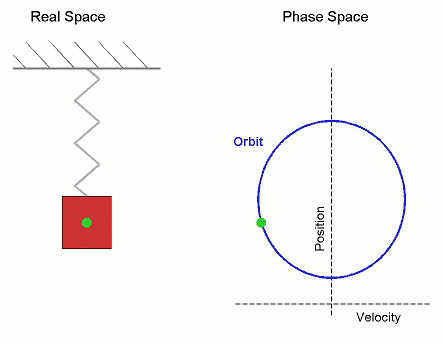

## 2023/12/06

*本科教育应给同学们“发现美的眼睛”*

*GNoME (AI): (11.29 "Nature") 发现220万晶体模型，如果人类来做可能需要800年*

### 1. SHO again 再谈简谐振子

#### (1) The phase space of SHO 简谐振子的相空间

We can express $(x, p)$ in phase space (相空间):

The energy of a SHO is the sum of its potential energy and kinetic energy: $$E = {1 \over 2} kx^2 + {p^2 \over 2m}.$$

Write let the left-hand side be $1$, and we have $${p^2 \over 2mE} + {x^2 \over 2E / k} = 1,$$ which is an ellipse (椭圆).

According to this we have **phase flow (相流)** and **phase trajectory (相轨道)**.

#### (2) Using boundary conditions to find a solution 用边界条件计算简谐振子的解

The basic function is $\ddot{x} + \omega_0^2 x = 0$. Its general solution is $$x = C_1 \cos \omega_0 t + C_2 \sin \omega_0 t.$$

To figure out the values of $C_1$ and $C_2$, we need boundary conditions (边界条件) (for example, initial conditions), for example, when $t = 0$, $x = x_0$ and $\displaystyle \frac{\mathrm{d}x}{\mathrm{d}t} = 0$.

In this scenario, when $t = 0$:
- $x = C_1 = x_0$;
- $\displaystyle \left. \frac{\mathrm{d}x}{\mathrm{d}t} \right|_{t = 0} = - \omega_0 C_1 \sin \omega_0 t + \omega_0 C_2 \cos \omega_0 t \Big|_{t = 0} = C_2 \omega_0 = 0$.

That is, $C_1 = x_0$, and $C_2 = 0$.

From $C_2 = 0$, we can simplify $x$ to $$x = x_0 \cos \omega_0 t.$$ Thus, we have $$\frac{\mathrm{d}x}{\mathrm{d}t} = - \omega_0 x_0 \sin \omega_0 t$$ and $$\frac{\mathrm{d}^2 x}{\mathrm{d}t^2} = - \omega_0^2 x_0 \cos \omega_0 t = - \omega_0^2 x,$$ where $\displaystyle \omega_0 = \sqrt{k \over m}.$

#### (3) A general method to calculate the equation of motion of a particle with known potential energy $U(x)$ and conserved energy $E$ 解已知势能和守恒的总能量的质点的运动方程的一种通法

The general method (under any given potential energy $U(x)$) is: $$E = {1 \over 2} m \dot{x}^2 + U(x).$$ From this, we can get $$\frac{\mathrm{d}x}{\mathrm{d}t}  = \pm \sqrt{\frac{2}{m}[E - U(x)]}.$$ Integrate this, we can get $$\int_{0}^{t} \mathrm{d}t = \int_{x_0}^{x} \pm \frac{\mathrm{d}x}{\sqrt{\dfrac{2}{m}[E - U(x)]}},$$ from which we can acquire the equation of motion.

**An example of using this method to solve the equation of motion of SHO 用这种方法解出简谐振子方程的示例:**

In the particular case of SHO, we know the energy of the particle $$E = {1 \over 2} k x_0^2$$ and the potential energy $$U(x) = {1 \over 2} k x^2.$$

Substitute $E$ and $U(x)$ in the equation above, and we have $$\int_{0}^{t} \mathrm{d}t = \int_{x_0}^{x} \pm \frac{\mathrm{d}x}{\sqrt{\dfrac{2}{m}\left( \dfrac{1}{2} k x_0^2 - \dfrac{1}{2} k x^2 \right)}} = \int_{x_0}^{x} \pm \frac{\mathrm{d}x}{\omega_0 \sqrt{\left( x_0^2 - x^2 \right)}}$$ $$t = \pm {1 \over \omega_0} \arccos \left( {x \over x_0} \right)$$ $$\cos (\mp \omega_0 t) = {x \over x_0}$$ $$x = x_0 \cos \left( \mp \omega_0 t \right) = x_0 \cos \omega_0 t,$$ which is the equation of motion of the SHO.

#### (4) Series expansion of the equation of motion of the SHO 简谐振子运动方程的级数展开

The basic form of the series expansion of $x(t)$ is $$x(t) = a_0 + a_1 t + a_2 t^2 + \cdots + a_n t^n + \cdots = a_0 + \sum_{i = 1}^{\infin} a_i x^i.$$

When $t = 0$, $x = x_0$, and therefore $a_0 = x_0$.

Take the first derivative of $x$, and we get $$\frac{\mathrm{d}x}{\mathrm{d}t} = a_1 + 2a_2 t + \cdots + n a_n t^{n - 1} + \cdots.$$ Because when $t = 0$, $\displaystyle \frac{\mathrm{d}x}{\mathrm{d}t} = 0$, $a_1 = 0$.

Take the second derivative of $x$, and we get $$\frac{\mathrm{d}^2x}{\mathrm{d}t^2} = 2a_2 + 6 a_3 t + 12 a_4 t^2 + \cdots + n(n - 1) a_n t^{n - 2} + \cdots.$$ Also, we know $\ddot{x} = - \omega_0^2 x = - \omega_0^2 \left( a_0 + a_1 t + a_2 t^2 + \cdots + a_n t^n + \cdots \right)$. Thus, we have $6a_3 = - \omega_0^2 a_1$, and $a_3 = a_1 = 0$.

Take more derivatives of $x$, and in similar ways, we will know that $$a_1 = a_3 = a_5 = \cdots = a_{2n + 1} = 0.$$

This conclusion can be verified by the series expansion of the cosine function: $$x = x_0 \cos \omega_0 t = x_0 \sum_{n = 0}^{\infin} \frac{(-1)^n x^{2n}}{(2n)!} = x_0 \left( 1 - \frac{x^2}{2} + \frac{x^4}{4!} - \frac{x^6}{6!} + \cdots \right).$$

> 作业：托尔斯泰《战争与和平》中的微积分体现在哪里？
>
> 比如人之将死，就是积分到了上限；期末考试积分的是你的所有的60个学时的努力。

*托尔斯泰的伟大可见一斑。*

### 2. Features of an inertial coordinate system 惯性系的特征

According to Landau, an inertial coordinate system has 3 aspects:

1. Space:
    1. Homogeneity (homogeneous) 空间同质性 $${\partial L \over \partial \boldsymbol{r}_\alpha} = \boldsymbol{0}$$
    2. Isotropy (isotropic) 空间各向同性 $$\boldsymbol{v} \cdot \boldsymbol{v}, \boldsymbol{v}^4, \boldsymbol{v}^6, \cdots, \boldsymbol{v}^{2n}, \cdots \quad L(\boldsymbol{v} \cdot \boldsymbol{v}, t)$$
2. Time: Homogeneity 时间同质性 $$L(\boldsymbol{v} \cdot \boldsymbol{v})$$
3. Simplicity 简单性

### 3. Galilean group 伽利略群

*写这里的时候参考了[https://en.wikipedia.org/wiki/Galilean_transformation#Galilean_transformations](https://en.wikipedia.org/wiki/Galilean_transformation#Galilean_transformations).*

Here we use $(t, \boldsymbol{r})$ to express a general point in spacetime (时空中任意一点).

The Galilean symmetries can be uniquely written as the composition of a uniform motion of spacetime, a translation and a rotation:

1. Uniform motion with velocity $\boldsymbol{V}$ (速度为$\boldsymbol{V}$的匀速运动变换)

    $$g_1(t, \boldsymbol{r}) = (t, \boldsymbol{r} - \boldsymbol{V}t)$$

    This transformation has 3 dimensions.

2. Spatial and time translation (时间和空间平移变换)

    $$g_2(t, \boldsymbol{r}) = (t + \tau, \boldsymbol{r} + \boldsymbol{s})$$

    This transformation has 4 dimensions and is called an **affine transformation** (仿射变换).

3. Rotation (旋转变换)

    $$g_3(t, \boldsymbol{r}) = (t, \mathbf{R} \cdot \boldsymbol{r})$$

    This transformation has 3 dimensions.

As a Lie group, the group of Galilean transformations has dimension $10 \ (3 + 4 + 3 = 10)$.

The Galilean Group is a highly generalized representation of Newtonian mechanics.  Newtonian mechanics is a group that holds under Galilean transformations. (伽利略群是对牛顿力学的高度概括。牛顿力学是伽利略变换不变的群。)
