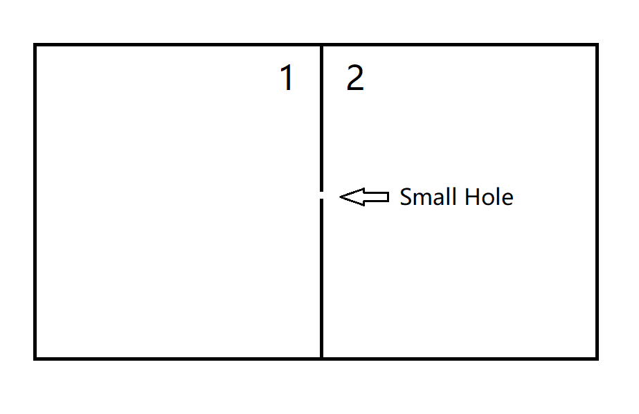

## 2023/10/11

### 1. Phase an group velocity 相速度和群速度

Phase velocity (相速度) $v_p$ is the velocity of a certain phase that travels:

$$v_p = {\omega \over k}$$

Group velocity (群速度) $v_g$ is the velocity with which the envelope of the wave (波包) propagates through space. 

$$v_g = {\Delta \omega \over \Delta k}$$

Energy is transmitted through *group velocity*, not 

You can refer to this below:

> 
>
> The ■ red square moves with the phase velocity, and the ● green circles propagate with the group velocity. (Source: Wikipedia)
>
> For more reference, you can see: [https://www.zhihu.com/question/29444240/answer/1833520606](https://www.zhihu.com/question/29444240/answer/1833520606).

### 2. Order of magnitude 数量级

For a number $N$, we usually define its *order of magnitude* as follows:

Write the number in the form $$N =a \times 10 ^ b,$$ in which $$\dfrac{1}{\sqrt{10}} \leq a \leq \sqrt{10}, \ b \in \Bbb{Q},$$ and $b$ is the *order of magnitude* of the number.

Of course this definition is not absolute, and some people tend to use $0.5 \leq a \leq 5$ or other criteria.

For example:

| $N$ | Expression in $N =a \times 10^b$ | Order of magnitude $b$ |
|-|-|-|
| 0.2 | 2 × 10−1 |−1 |
| 1 | 1 × 100 |0 |
| 5 | 0.5 × 101 |1|
| 6 | 0.6 × 101 |1|
| 31 | 3.1 × 101 | 1|
| 32 | 0.32 × 102 | 2|
| 999 | 0.999 × 103| 3|
| 1000 | 1 × 103| 3 |

Some constants in physics: 

- Avogadro constant $N_A = 6.02 \times 10^{23} \ \mathrm{mol^{-1}}$
- Reduced Planck constant $\hbar = 1.054 \times 10^{-34} \ \mathrm{J \cdot s}$
- Speed of light $c = 2.99792 \times 10^{8} \ \mathrm{m/s}$
- Boltzmann constant $k_\mathrm{B} = 1.38 \times 10^{-23} \ \mathrm{J/K}$
- Fundamental charge $e = 1.602 \times 10^{-19} \ \mathrm{C}$
- Universal gravitational constant $G = 6.672 \times 10^{-11} \ \mathrm{N \cdot m^2/kg^2}$

### 3. A particular model 某个模型

Below is a container with two sides connected to each other by a "small hole".

To get the two sides to balance, we need to have

$$
\left\{
\begin{align*}
& p_1 = p_2 \ \ \  &\text{pressure} &\\[1ex]
& T_1 = T_2 \ \ \ &\text{temperature} &\\[1ex]
& \mu_1 = \mu_2 \ \ \ &\text{chemical potential (化学势)} &
\end{align*}
\right.
$$

Chemical potential $\mu$ is defined as follows:

In a chemical system where there are $n$ kinds of species (物种), define **Gibbs free energy** (吉布斯自由能) $$G=U-TS+pV$$ and the **chemical potential** (化学势) of species $i$ $$\mu_i = \left({\partial G \over \partial n_i}\right)_{T, p, n_j (j \neq i)}.$$

### 4. Something about dimensional analysis and unit systems 一些关于量纲分析和单位制的东西

Maxwell points out that:

1. For a mechanical quantity (力学量), we only meed three dimensions $\mathrm{M, L, T}$ to form its unit and

2. Sometimes the dimensions of combined quantities are more useful.

There are two commonly-used unit systems in the world:
- *Système International* (SI) 国际单位制
- Centimetre–gram–second system of units (CGS) 厘米—克—秒制

Let's look at a few examples.

#### (1) Coulomb's law 库仑定律

$$F = \left\{
\begin {align*}
& \dfrac{q_1q_2}{4 \pi \varepsilon_0 r^2} & \text{(SI)} \\[3ex]
& \dfrac{q_1q_2}{r^2} & \text{(CGS)}
\end {align*}
\right.
$$

#### (2) Fine structure constant 精细结构常数

$$\alpha = \left\{
\begin {align*}
& \dfrac{e^2}{4 \pi \varepsilon_0 \hbar c} & \text{(SI)} \\[3ex]
& \dfrac{e^2}{\hbar c} & \text{(CGS)}
\end {align*}
\right.
\approx {1 \over 137}
$$

*W. Pauli died in Room No. 137 in hospital. (地狱笑话了属于是)*

#### (3) Bohr radius 玻尔半径

$$r_B = \left\{
\begin {align*}
& \dfrac{4 \pi \varepsilon_0 \hbar^2}{m_ee^2} & \text{(SI)} \\[3ex]
& \dfrac{\hbar^2}{m_ee^2} & \text{(CGS)}
\end {align*}
\right.
$$

### 5. Planck units 普朗克单位

Planck units are a set of units that, by definition, are expressed using these universal constants below, which, have the numeric value $1$ when expressed:

- the speed of light in vacuum $c$
- the gravitational constant $G$
- the reduced Planck constant $\hbar$
- the Boltzmann constant $k_\mathrm{B}$

Typically we would use dimensional analysis to derive these units.

$$[c] = \mathrm{LT^{-1}}$$

$$[G] = {[F][r^2] \over [m_1m_2]} = \mathrm{\dfrac{ML}{T^2} \cdot L^2 \over M^2} = \mathrm{M^{-1}L^3T^{-2}}$$

$$[\hbar] = [E][t] = [mc^2][t] = \mathrm{ML^2T^{-1}}$$

$$[k_\mathrm{B}] = {[E] \over [T]} = {[mc^2] \over [T]} = \mathrm{ML^2T^{-2}\Theta^{-1}}$$

#### (1) Planck length 普朗克长度

$$\left[{G \hbar \over c^3}\right] = \mathrm{M^{-1}L^3T^{-2} \cdot ML^2T^{-1} \over (LT^{-1})^3} = \mathrm{L^2}$$

$$l_P = \sqrt{G \hbar \over c^3}$$

#### (2) Planck time 普朗克时间

$$t_P = {l_P \over c} = \sqrt{G \hbar \over c^5}$$

#### (3) Planck mass 普朗克质量

$$\left[{\hbar c \over G}\right]  = \mathrm{ML^2T^{-1} \cdot LT^{-1} \over M^{-1}L^3T^{-2}} = \mathrm{M^2}$$

$$m_P = \sqrt{\hbar c\over G}$$

#### (4) Planck temperature 普朗克温度

$$\left[{\hbar c^5 \over Gk_\mathrm{B}^2}\right] = \mathrm{ML^2T^{-1} \cdot (LT^{-1})^5 \over M^{-1}L^3T^{-2} \cdot (ML^2T^{-2}\Theta^{-1})^2} = \mathrm{\Theta^2}$$

$$T_P = \sqrt{\hbar c^5 \over Gk_\mathrm{B}^2}$$

#### (5) Planck energy 普朗克能量

$$E_P = m_Pc^2 = \sqrt{\hbar c^5\over G}$$

#### (6) Planck momentum 普朗克动量

$$p_P = m_Pc = \sqrt{\hbar c^3\over G}$$

#### (7) Planck acceleration 普朗克加速度

$$a_P = {c \over t_P} = \sqrt{c^7 \over \hbar G}$$

#### (8) Planck force 普朗克力

$$F_P = m_P a_P = {c^4 \over G}$$

Note that the Planck force can be *hidden* in the Einstein gravitational field equations:

$$R_{\mu\nu} - {1 \over 2}g_{\mu\nu}R = 8 \pi \red{G \over c^4}T_{\mu\nu} = {8 \pi \over \red{F_P}} T_{\mu\nu}$$

*隐藏在引力方程中的力，被称为引力很合理吧？这恒河里！doge*

#### (9) Planck density 普朗克密度

$$\rho_P = {m_P \over {l_P}^3} = {c^5 \over \hbar G^2}$$

