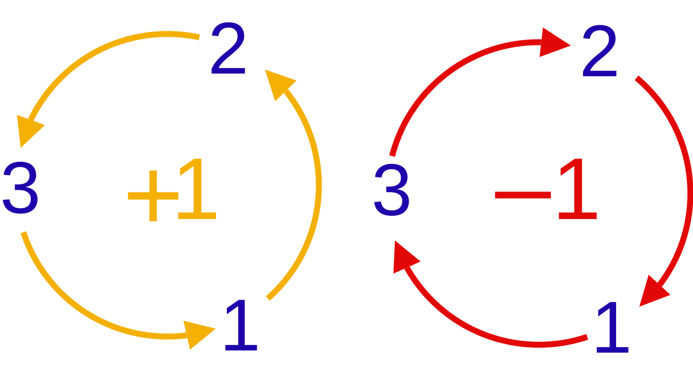

## 2023/10/16

### 1. Something about dimension analysis and Planck units 一些关于量纲分析和普朗克单位的内容

#### (1) Einstein radius 爱因斯坦角半径

The Einstein radius, $\theta_E$,  is the radius of an Einstein ring, and

$$\theta_E = \sqrt{4GM \over c^2 \cdot D_r},$$

where $D_r$ is the *impact parameter* (the distance of nearest approach of the lightbeam to the center of mass).

#### (2) Planck charge 普朗克电量

From the fine structure constant $\alpha = \dfrac{e^2}{\hbar c}$ (under $\text{cgs}$ system), we can see that $$[e^2] = [\hbar c].$$

Therefore, we can define the Planck charge $$e_P = \sqrt{\hbar c}.$$

### 2. Gauge transformation (by Hermann Weyl) 规范场变换

From the second equation of the Maxwell equations $$\nabla \cdot \boldsymbol B = 0,$$ we can see $B$ as the curl of a certain vector $\boldsymbol A$. We call this $\boldsymbol A$ **magnetic vector potential** (磁矢势), and $$\boldsymbol B  = \nabla \times \boldsymbol A.$$

Because the curl of the gradient of a certain scalar (标量梯度的旋度) is zero, we can add a scalar field $\psi$, and 

$$\boldsymbol A \mapsto \boldsymbol A + \nabla \psi \  (*)$$

$$\boldsymbol B  = \nabla \times (\boldsymbol A + \nabla \psi).$$

From $$\nabla \times \boldsymbol E = -{\partial \boldsymbol B \over \partial t}$$ and put the $\boldsymbol B$ in, we can get $$\nabla \times \boldsymbol E = - {\partial \over \partial t}(\nabla \times \boldsymbol A) = - \nabla \times {\partial \boldsymbol A \over \partial t}$$

$$\nabla \times (\boldsymbol E + {\partial \boldsymbol A \over \partial t}) = \boldsymbol 0.$$

From this we can see $\boldsymbol E + \dfrac{\partial \boldsymbol A }{ \partial t}$ as the negative of the gradient of a scalar field $\varphi$ (标量场 $\varphi$ 梯度的负), and $$\boldsymbol E = - \dfrac{\partial \boldsymbol A }{ \partial t} - \nabla \varphi.$$

When we put in the $\boldsymbol A$ shown by $(*)$, we can get:

$$
\begin{align*}
\boldsymbol E & = - \dfrac{\partial}{ \partial t}(\boldsymbol A + \nabla \psi) - \nabla \varphi \\[2ex]
& = - \dfrac{\partial \boldsymbol A }{ \partial t} - \nabla \left(\varphi + {\partial \psi \over \partial t}\right).
\end{align*}
$$

This shows that, when we make the transformation below (**the gauge transformation** 规范变换)

$$
\left\{
\begin{array} {l}
\boldsymbol A \mapsto \boldsymbol A + \nabla \psi \\[1ex]
\varphi \mapsto \varphi - \dfrac{\partial \psi}{\partial t}
\end{array}
\right.
$$

We can ensure that the fields $\boldsymbol B$ and $\boldsymbol E$ remain unchanged.

### 3. The Kronecker Delta 克罗尼克符号

Define the Kronecker Delta:

$$\delta_{ij} = \left\{
\begin{align*}
1,\ \ &i = j \\
0,\ \ &i \neq j
\end{align*}
\right.
$$

Example of practical use:

$$\boldsymbol a \cdot \boldsymbol b = (a_i \boldsymbol e_i) \cdot (b_j \boldsymbol e_j) = a_ib_j \delta_{ij}$$

### 4. The Levi-Civita Symbol 列维-奇维塔符号

Define the Levi-Civita Symbol:

$$\boldsymbol e_i \times \boldsymbol e_j = \varepsilon_{ijk} \boldsymbol e_k.$$

In other words,

$$\varepsilon_{ijk} = \left\{
\begin{align*}
1, & \ \ &\text{even permutation (偶置换)}  \\
-1, & & \text{odd permutation (奇置换)}\\
0, & & i=j \ \text{or} \ i = k \ \text{or} \ j = k  (有重合指标)
\end{align*}
\right.
$$

In the following picture, the left is for even permutations, and the right for odd permutations.

In word form, if $(i,j,k)$ is $(1,2,3)$, $(2,3,1)$ or $(3,1,2)$, then $\varepsilon_{ijk} = 1$. If $(i,j,k)$ is $(3,2,1)$, $(1,3,2)$ or $(2,1,3)$, then $\varepsilon_{ijk} = -1$.

Example of practical use:

$$\boldsymbol a \times \boldsymbol b = (a_i \boldsymbol e_i) \times (b_j \boldsymbol e_j) = a_ib_j \varepsilon_{ijk} \boldsymbol e_k$$

### 5. Einstein summation convention 爱因斯坦求和约定

In this notation, when an index variable appears twice in a single term and is not otherwise defined, it implies summation of that term over all the values of the index.

For example, if index $i$ ranges over the set $\{1, 2, 3\}$, then $y = c_ix^i$ means $$y = \sum_{i=1}^3 c_ix_i = c_1x_1 + c_2x_2 + c_3x_3.$$

An index that is summed over is a **summation index**, in this case $i$. It is also called a dummy index (哑标) since any symbol can replace $i$ without changing the meaning of the expression (provided that it does not collide with other index symbols in the same term).

An index that is not summed over is a **free index** (自由指标) and should appear only once per term.  If such an index does appear, it usually also appears in every other term in an equation. An example of a free index is the $i$ in the equation $v_i = a_i b_j x^j$, which is equivalent to the equation $v_i = \sum_j(a_i b_j x^j)$.

Examples:

#### (1) Lorentz force

$$\boldsymbol F = q(\boldsymbol E + \boldsymbol v \times \boldsymbol B)$$

$$F_k = q (E_k + v_i B_j \varepsilon_{ijk})$$

Dummy indices $-$ $i$, $j$; Free index $-$ $k$

#### (2) Maxwell equations

$$
\left\{
\begin{align*}
&\dfrac{\partial E_i}{\partial x^i} = \dfrac{\rho}{\varepsilon_0} & \ \ &  i \text{ -- Dummy index}\\[2ex]
&\dfrac{\partial B_i}{\partial x^i} = 0 && i \text{ -- Dummy index}\\[2ex]
&\dfrac{\partial E_j}{\partial x_i}\varepsilon_{ijk} = - \dfrac{\partial B_k}{\partial t} && i, j \text{ -- Dummy indices;} \ k \text{ -- Free index}\\[2ex]
&\dfrac{\partial B_j}{\partial x_i}\varepsilon_{ijk} = \mu_0\left( j_k + \varepsilon_0\dfrac{\partial E_k}{\partial t}\right) && i, j \text{ -- Dummy indices;} \ k \text{ -- Free index}
\end{align*}
\right.
$$
