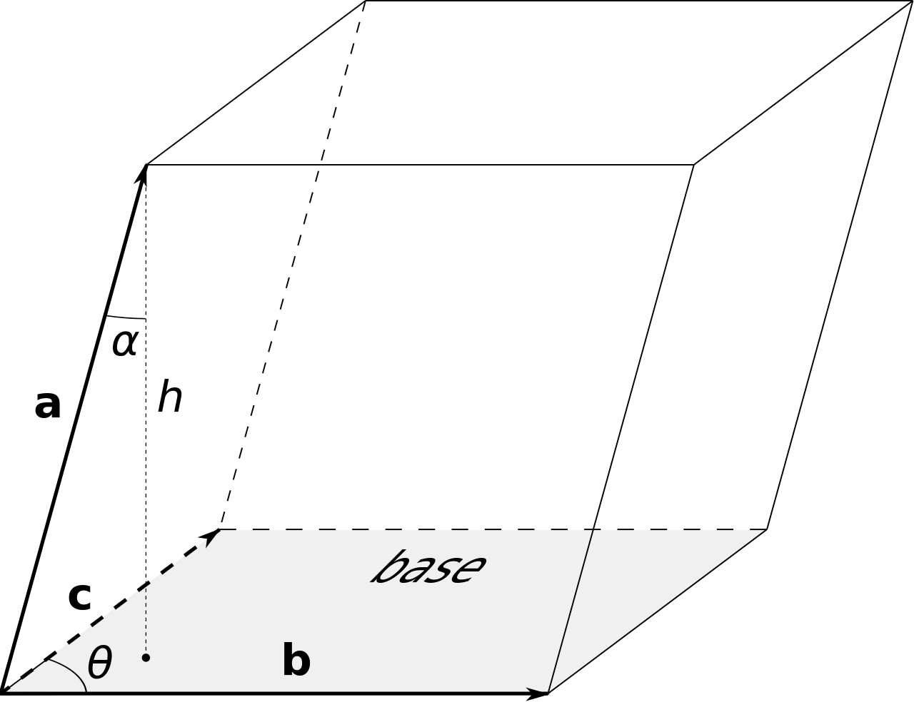

## 2023/10/30

### 1. Lift 升力

*Science American*: No One Can Explain Why Planes Stay in the Air (by Ed Regis)

(This article was originally published with the title "The Enigma of Aerodynamic Lift" in Scientific American 322, 2, 44-51 (February 2020))

> 作业：Einstein 如何解释河流的弯曲？

> 作业：Einstein 的茶叶悖论是什么

### 2. Scalar triple product 标量三重积

$\vec a, \vec b, \vec c$ can form a parallelepiped ($\vec a, \vec b, \vec c $ 可以组成平行六面体):

 

The volume of this parallelepiped:

$$V = \vec a \cdot (\vec b \times \vec c) = \vec c \cdot (\vec a \times \vec b) = \vec b \cdot (\vec c \times \vec a)$$

$$\vec a \cdot (\vec b \times \vec c) = \vec a \cdot (b_i c_j \varepsilon_{ijk} \vec e_k) = b_i c_j a_k \varepsilon_{ijk}$$

$$\vec b \cdot (\vec c \times \vec a) = \vec b \cdot (c_i a_j \varepsilon_{ijk} \vec e_k) = c_i a_j b_k \varepsilon_{ijk}$$

$$\vec c \cdot (\vec a \times \vec b) = \vec c \cdot (a_i b_j \varepsilon_{ijk} \vec e_k) = a_i b_j c_k \varepsilon_{ijk}$$

Here above, $i$, $j$ and $k$ are all dumb indices (哑标).

We usually record

$$
\begin{align*}
\begin{bmatrix} \vec a & \vec b & \vec c \end{bmatrix} & = \vec a \cdot (\vec b \times \vec c) = \vec c \cdot (\vec a \times \vec b) = \vec b \cdot (\vec c \times \vec a) \\
& = \begin{vmatrix}
        a_1 & a_2 & a_3 \\
        b_1 & b_2 & b_3 \\
        c_1 & c_2 & c_3
 \end{vmatrix}.
\end{align*}
$$

### 3. Static equilibrium conditions (derived using virtual work) (用虚功原理推导的) 静力平衡条件

In mechanics, there are two kinds of displacements (位移):
  - real displacement 实位移
  - virtual displacement 虚位移

The static equilibrium conditions are:
  - Resultant force 合力
  $$\sum_i \overrightarrow F_i = \vec 0$$
  - Resultant torque/moment 合力矩
  $$\sum_i \vec r_i \times \overrightarrow F_i = \sum_i \vec \tau_i = \vec 0$$

For a rigid body (刚体), there are 2 kinds of motion:
  - translation 平动
  - rotation 转动

When calculating virtual work, we assume that we have 
  - In translation: virtual displacement $\delta \vec u_0$
  - In rotation: virtual rotationla angle $\delta \vec \Theta$

The resultant virtual displacement (总虚位移) is 

$$\delta \vec u_i = \delta \vec u_0 + \delta \vec \Theta \times \vec r_i$$

Virtual work

$$
\begin{align*}
\delta W & = \sum_i \overrightarrow F_i \cdot \delta \vec u_i \\
& = \sum_i \left( \overrightarrow F_i \cdot \delta \vec u_0 \right) + \sum_i \left[ \overrightarrow F_i \cdot \left (\delta \vec \Theta \times \vec r_i \right) \right] \\
& = \delta \vec u_0 \cdot \sum_i \overrightarrow F_i + \sum_i \left[ \delta \vec \Theta \cdot \left (\vec r_i \times \overrightarrow F_i \right) \right] \\
& = \delta \vec u_0 \cdot \sum_i \overrightarrow F_i + \delta \vec \Theta \cdot \sum_i \left (\vec r_i \times \overrightarrow F_i \right)
\end{align*}
$$

Because $\delta \vec u_0$ and $\delta \vec \Theta$ are arbitrary (任意的，任取的), and work is positive definite (功具有正定性), in equilibrium we have 

$$\delta W = 0 \Rightarrow 
\left\{
\begin{array}{ll}
\delta \vec u_0 \cdot \sum_i \overrightarrow F_i = 0 & \Rightarrow  \sum_i \overrightarrow F_i = \vec 0
\\[1.5ex]
\delta \vec \Theta \cdot \sum_i \left (\vec r_i \times \overrightarrow F_i \right) = 0 & \Rightarrow  \sum_i \left (\vec r_i \times \overrightarrow F_i \right) = \vec 0.
\end{array}
\right.
$$
