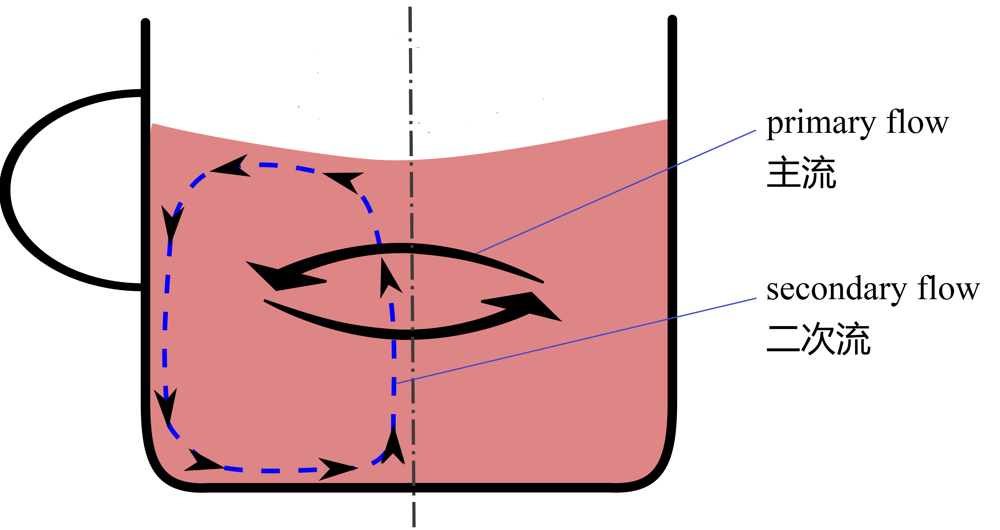

## 2023/11/01

*如果你对一个问题了解不深，但你仍去做科普，那么你很有可能造成误导的效果。*

### 1. Tea leaf paradox 茶叶佯谬

When the fluid is stirred, stirring makes the primary flow (as shown in the picture). It is easy to know that the surface of the water is a paraboloid (抛物面), which is higher near the edge of the cup. Thus, the pressure near the edge is greater than the center.

According to Bernoulli's principle, the greater the pressure, the less the speed of flow.

Thus the centrifugal force is weaker near the bottom than higher up, leading to a secondary flow (二次流) that goes outwards at the top, down along the outer edge, inwards along the bottom, bringing the leaves to the center, and then up again.

> 作业：拜耳定律是什么？

### 2. Rotation system 旋转系统

#### (1) Special orthogonal group 特殊正交群

$$
\left\{
\begin{array}{l}
\hat i = \hat i' \cos \theta - \hat j' \sin \theta\\
\hat j = \hat i' \sin \theta + \hat j' \cos \theta
\end{array}
\right.
$$

Put it in matrix form, and we get:

$$
\begin{pmatrix}
\hat i \\
\hat j
\end{pmatrix}
=
\begin{pmatrix}
\cos \theta & -\sin \theta \\
\sin \theta & \cos \theta
\end{pmatrix}
\begin{pmatrix}
\hat i' \\
\hat j'
\end{pmatrix}
$$

Let 

$$
\mathbf R(\theta) = 
\begin{pmatrix}
\cos \theta & -\sin \theta \\
\sin \theta & \cos \theta
\end{pmatrix}
$$

and we know that $\mathbf R$ has the following qualities:

(1) $\det \mathbf R = 1.$ This means that $\mathbf R$ is a **special orthogonal group (特殊正交群, SO)**, and one such group in dimension $n$ is denoted $\operatorname{SO}(n)$. In this case, $\mathbf R$ is $\operatorname{SO}(2)$ (二维特殊正交群).

(2) $\mathbf R^\mathrm{T}(\theta) = \mathbf R^{-1} (\theta).$ Here, $\mathrm T$ is short for **transpose (转置)**, and $-1$ for **inverse (逆)**.

$$\mathbf R^\mathrm{T}(\theta) \mathbf R(\theta) = \mathbf R^{-1} (\theta) \mathbf R(\theta) = \mathbf I = \begin{pmatrix}
1 & 0 \\
0 & 1
\end{pmatrix}.$$

> 作业：什么是流形？

A group has four kinds of properties:

  1. Closure 封闭性
  2. Associative 结合性
  3. Unitarity 幺正性
  4. Inverse 有逆

> 作业：阿贝尔群 (Abel Group) 是什么？
>
> （满足可交换性的群，如旋转群 $\mathbf R(\theta_2) \mathbf R(\theta_1) = \mathbf R(\theta_1) \mathbf R(\theta_2).$）

#### (2) $\operatorname U(1)$ Group &nbsp; $\operatorname U(1)$ 群

Here $\operatorname U(1)$ stands for `unitarity 酉(即幺正)`.

$$\operatorname U(\theta) = \mathrm e^{\mathrm i \theta} = \cos \theta + \mathrm i \sin \theta \quad (*)$$

The conjugate (共轭) of $(*)$ is 

$$\operatorname U^*(\theta) = \mathrm e^{- \mathrm i \theta} = \cos \theta - \mathrm i \sin \theta \quad (*)$$

$$\operatorname U^*(\theta)  = 1$$

We can see that $\operatorname{SO}(2)$ is an isomorphism (同构) of $\operatorname U(\theta)$: $$\operatorname{SO}(2) \cong \operatorname U(\theta).$$

> 作业：什么是同构？
>
> 群 $G$ 与 $G'$ 是同构的，如果存在一个双射 $\varphi: G \to G'$ ，满足 $\varphi(xy) = \varphi(x)\varphi(y)$ ，其中 $x, y \in G$ 。双射 $\varphi$ 称为群 $G$ 和 $G'$ 的一个同构，记为 $G \cong G'.$

### 3. Acceleration decomposition in polar coordinates 极坐标下的加速度分解

$$
\left\{
\begin{array}{l}
\hat i' = \cos \theta \hat i + \sin \theta \hat j \\
\hat j' = - \sin \theta \hat i + \cos \theta \hat j
\end{array}
\right.
$$

$$
\left\{
\begin{array}{l}
\dfrac{\mathrm d \hat i'}{\mathrm d t} = (- \sin \theta \hat i + \cos \theta \hat j) \dot \theta = \dot \theta \hat j' \\[2ex]
\dfrac{\mathrm d \hat j'}{\mathrm d t} = (- \cos \theta \hat i - \sin \theta \hat j) \dot \theta = - \dot \theta \hat i'
\end{array}
\right.
$$

Radius vector $$\boldsymbol r = r \hat i'$$

Velocity $$\boldsymbol v' = \dfrac{\mathrm d \boldsymbol r}{\mathrm dt} = \dfrac{\mathrm dr}{\mathrm dt} \hat i' + r \dfrac{\mathrm d \hat i'}{\mathrm dt} = \dfrac{\mathrm dr}{\mathrm dt} \hat i' + r \dot \theta \hat j' = v_r \hat i' + v_\theta \hat j'$$

Acceleration 

$$
\begin{align*}
\boldsymbol a & = \dfrac{\mathrm d \boldsymbol v}{\mathrm dt} = \dfrac{\mathrm d}{\mathrm dt} \left( \dfrac{\mathrm dr}{\mathrm dt} \hat i' + r \dot \theta \hat j' \right) \\
& = \dfrac{\mathrm d^2 r}{\mathrm dt^2} \hat i' + \dfrac{\mathrm dr}{\mathrm dt} \dot \theta \hat j' + \dfrac{\mathrm dr}{\mathrm dt} \dot \theta \hat j' +  r \ddot \theta \hat j' +  r \dot \theta (- \dot \theta \hat i') \\
& = (\ddot r - r \dot \theta^2) \hat i' + (r \ddot  \theta + 2 \dot r \dot \theta) \hat j'
\end{align*}
$$

*整理者附：这个推导好像跟科氏加速度没有半毛钱关系啊……*
*注：赵老师上课说的所谓“科氏加速度”指的是 $2 \dot r \dot \theta \hat j'$ 一项*

### 4. Transport theorem in a rotation system 旋转系的输运定理

#### (1) Derivation 推导

In a rotation system, we have the base factors $\hat i'$ and $\hat j'$, we have 

$$\dfrac{\mathrm d \hat r}{\mathrm dt} = \boldsymbol \omega \times \hat r,$$

where $\boldsymbol \omega = (0, 0, \omega),$ and $\hat r = (\hat i', \hat j', \hat k')$.

$$
\dfrac{\mathrm d \hat i'}{\mathrm dt} = 
\begin{vmatrix}
\hat i' & \hat j' & \hat k' \\
0 & 0 & \omega \\
1 & 0 & 0
\end{vmatrix}
= \omega \hat j'
$$

$$
\dfrac{\mathrm d \hat j'}{\mathrm dt} = \begin{vmatrix}
\hat i' & \hat j' & \hat k' \\
0 & 0 & \omega \\
0 & 1 & 0
\end{vmatrix}
= - \omega \hat i'$$

Let $\boldsymbol f = f_x \hat i' + f_y \hat j' + f_z \hat k'$, and

$$
\begin{align*}
\dfrac{\mathrm d \boldsymbol f}{\mathrm dt} & = \left( \dfrac{\mathrm df_x}{\mathrm dt} \right)_r \hat i' + \left( \dfrac{\mathrm df_y}{\mathrm dt} \right)_r \hat j' + \left( \dfrac{\mathrm df_z}{\mathrm dt} \right)_r \hat k' + f_x \dfrac{\mathrm d \hat i'}{\mathrm dt} + f_y \dfrac{\mathrm d \hat j'}{\mathrm dt} + f_z \dfrac{\mathrm d \hat k'}{\mathrm dt} \\[2ex]
& = \left( \dfrac{\mathrm d \boldsymbol f}{\mathrm dt} \right)_r + f_x \boldsymbol \omega \times \hat i' + f_y \boldsymbol \omega \times \hat j' + f_z \boldsymbol \omega \times \hat k' \\[3ex]
& = \left[ \left( \dfrac{\mathrm d}{\mathrm dt}\right)_r + \boldsymbol \omega \times \right] \boldsymbol f
\end{align*}
$$

Let $\boldsymbol f = \boldsymbol r$, and we get

$$\boldsymbol v = \dfrac{\mathrm d \boldsymbol r}{\mathrm dt} = \left( \dfrac{\mathrm d \boldsymbol r}{\mathrm dt}\right)_r + \boldsymbol \omega $$

$$
\begin{align*}
\boldsymbol a & = \dfrac{\mathrm d \boldsymbol v}{\mathrm dt} \\[2ex]
& = \left[ \left( \dfrac{\mathrm d}{\mathrm dt}\right)_r + \boldsymbol \omega \times \right] \left[ \left( \dfrac{\mathrm d \boldsymbol r}{\mathrm dt}\right)_r + \boldsymbol \omega \times \boldsymbol r \right] \\[2ex]
& = \left( \dfrac{\mathrm d^2 \boldsymbol r}{\mathrm dt^2}\right)_r + \left( \dfrac{\mathrm d \boldsymbol \omega}{\mathrm dt}\right)_r \times \boldsymbol r + 2 \boldsymbol \omega \times \left( \dfrac{\mathrm d \boldsymbol r}{\mathrm dt}\right)_r + \boldsymbol \omega \times (\boldsymbol \omega \times \boldsymbol r)\\[2ex]
\end{align*}
$$

#### (2) Example: Euler's equations in rigid body dynamics 刚体运动的欧拉方程

Basically, if we have the angular momentum  $\boldsymbol L$, angular velocity $\boldsymbol \omega$ and moment of inertia tensor (惯性张量) $\mathbf I$, we will have

$$\boldsymbol L = \mathbf I \cdot \boldsymbol \omega.$$

According to the Angular Momentum Theorem, we have

$$\dfrac{\mathrm d \boldsymbol L}{\mathrm dt} = \boldsymbol M,$$

where $\boldsymbol M$ is the external torque (外力矩). From this we can get

$$\left[ \dfrac{\mathrm d (\mathbf I \boldsymbol \omega)}{\mathrm dt}\right]_r + \boldsymbol \omega \times (\mathbf I \boldsymbol \omega) = \boldsymbol M$$

Because $\mathbf I$ is a constant, we have

$$
\mathbf I \left( \dfrac{\mathrm d \boldsymbol \omega}{\mathrm dt} \right)_r + 
\begin{vmatrix}
\hat i & \hat j & \hat k \\
\omega_1 & \omega_2 & \omega_3 \\
\mathrm I_{11} \omega_1 & \mathrm I_{22} \omega_2 & \mathrm I_{33} \omega_3 \\
\end{vmatrix}
=
\begin{pmatrix}
M_1 \\ M_2 \\ M_3
\end{pmatrix}
$$

In orthogonal principal axes of inertia coordinates the equations become

$$
\begin{align*}
\mathrm I_{11} \dfrac{\mathrm d \boldsymbol \omega_1}{\mathrm dt} + (\mathrm I_{33} - \mathrm I_{22}) \omega_2 \omega_3 & = M_1 \\[2ex]
\mathrm I_{22} \dfrac{\mathrm d \boldsymbol \omega_2}{\mathrm dt} + (\mathrm I_{11} - \mathrm I_{33}) \omega_2 \omega_3 & = M_2 \\[2ex]
\mathrm I_{33} \dfrac{\mathrm d \boldsymbol \omega_3}{\mathrm dt} + (\mathrm I_{22} - \mathrm I_{11}) \omega_2 \omega_3 & = M_3
\end{align*}
$$
