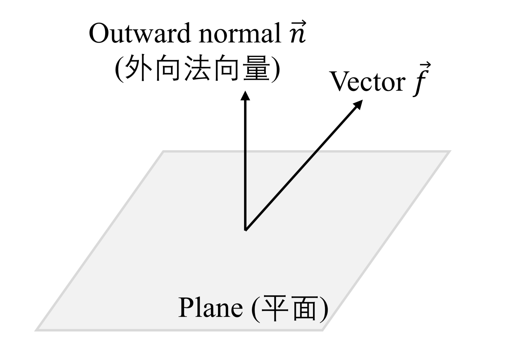

## 2023/11/06

### 1. Real and virtual displacement 实位移和虚位移

*见“菜鸡不啄天堂米”的整理。*

### 2. Something about tensors 一些关于张量的讨论

#### (1) Projection tensor 投影张量

The picture shows a plain with an outward tensor $\vec n$ ($\vec n \cdot \vec n = \vec n^2 = 1$), and we can get the projection of the vector $\vec f$:

$$\vec f_\perp = (\vec f \cdot \vec n) \vec n = \vec f \cdot (\vec n \otimes \vec n) \quad (*)$$

Thus we can get

$$\vec f_{/\!/} = \vec f - \vec f_\perp = \vec f - \vec f \cdot (\vec n \otimes \vec n) = \vec f \cdot (\mathbf e - \vec n \otimes \vec n).$$

Let $$\mathbf P = \mathbf e - \vec n \otimes \vec n,$$ and we call $\mathbf P$ the **projection tensor of rank 2 (二阶投影张量)**. An interesting piece of quality of $\mathbf P$ is:

$$
\begin{align*}
\mathbf P^2 & = (\mathbf e - \vec n \otimes \vec n)^2 \\
& = \mathbf e^2 - 2 \vec n \otimes \vec n + (\vec n \otimes \vec n) \cdot (\vec n \otimes \vec n) \\
& = \mathbf e - 2 \vec n \otimes \vec n + \vec n \otimes (\vec n \cdot \vec n) \otimes \vec n \\
& = \mathbf e - 2 \vec n \otimes \vec n + \vec n \otimes \vec n\\
& = \mathbf e - \vec n \otimes \vec n \\
& = \mathbf P.
\end{align*}
$$

Note: 

1. Above, $\otimes$ stands for tensor product (张量积).

2. The proof of $(*)$:
    $$
    \begin{align*}
    \vec f \cdot (\vec n \otimes \vec n) & = (f_k \vec e_k) \cdot (n_i n_j \vec e_i \otimes \vec e_j) \\
    & = (f_k \vec e_k \cdot n_i n_j \vec e_i) \vec e_j \\
    & = f_k n_i n_j \delta_{ik} \vec e_j \\
    & = f_i n_i n_j \vec e_j \\
    & = (\vec f \cdot \vec n) \vec n
    \end{align*}
    $$

#### (2) Moment of inertia tensor 惯性张量 $\boldsymbol I$

Angular momentum:

$$
\begin{align*}
\overrightarrow L & = \int \vec r \times \mathrm d \vec p \\
& = \int \vec r \times \rho \vec v \mathrm dV \\
& = \rho \int \vec r_i \times (\vec \omega \times \vec r_i) \mathrm dV \\
& = \rho \int [\vec \omega (\vec r_i \cdot \vec r_i) - \vec r_i (\vec r_i \cdot \vec \omega)] \mathrm dV \\
& = \rho \int [\vec \omega r_i^2 - (\vec r_i \otimes \vec r_i) \vec \omega] \mathrm dV \\
& = \left[ \rho \int (r_i^2 \mathbf e - \vec r_i \otimes \vec r_i) \mathrm dV \right] \cdot \vec \omega.
\end{align*}
$$

From $\overrightarrow L = \boldsymbol I \cdot \vec \omega$, we can see that

$$\boldsymbol I = \rho \int \left[ (x^2 + y^2 + z^2) \mathbf e - \vec r_i \otimes \vec r_i \right] \mathrm dV,$$

which, written in index form, is

$$I_{ij} = \rho \int \left[ (x^2 + y^2 + z^2) \delta_{ij} - x_ix_j \right]\mathrm dV.$$

Written in Cartesian coordinates are:

$$
\left\{
\begin{array}{l}
\displaystyle
I_{xx} = \rho \int \left( y^2 + z^2 \right) \mathrm dV \\[2ex]
\displaystyle
I_{yy} = \rho \int \left( x^2 + z^2 \right) \mathrm dV \\[2ex]
\displaystyle
I_{zz} = \rho \int \left( x^2 + y^2 \right) \mathrm dV \\[2ex]
\displaystyle
I_{xy} = \rho \int xy \mathrm dV \\[2ex]
\displaystyle
I_{yz} = \rho \int yz \mathrm dV \\[2ex]
\displaystyle
I_{xz} = \rho \int xz \mathrm dV \\[2ex]
\end{array}
\right..
$$

### 3. Two methods of deriving the conservation of the Laplace–Runge–Lenz (LRL) vector under a central force field that follows the inverse square law 两种推导平方反比有心力场下拉普拉斯-龙格-楞次矢量守恒的方法

The Laplace–Runge–Lenz (LRL) vector $\overrightarrow A$ is:

$$\overrightarrow A = \vec p \times \overrightarrow L - m \kappa \hat {\vec r}.$$

The following discussion is set under this specific central force field (有心力场) $U(r)$:

$$U(r) = - {GMm \over r} = - {\kappa \over r}.$$

In this central force field, there are three conserved qualities (守恒量):

  - $\displaystyle E = {p^2 \over 2m} - {\kappa \over r}$
  - $\displaystyle \overrightarrow L = \vec r \times \vec p$
  - $\displaystyle \overrightarrow A = \vec p \times \overrightarrow L - m \kappa \hat {\vec r}$

#### (1) Method 1

$$\overrightarrow A = \vec p \times \overrightarrow L - m \kappa \hat {\vec r}.$$

$$\dfrac{\mathrm d \overrightarrow A}{\mathrm dt} = \dot {\vec p} \times \overrightarrow L + \vec p \times \dot {\overrightarrow L} - m \kappa \dfrac{\mathrm d \hat {\vec r}}{\mathrm dt}.$$

In this, $\overrightarrow L$ is conserved, and thus $\dot {\overrightarrow L} = \vec 0.$

According to Newton's laws of motion, we have

$$\dot {\vec p} = \vec f = - {\kappa \over r^2} \hat {\vec r}.$$

Using transport theorem, we know that

$$\dfrac{\mathrm d \hat {\vec r}}{\mathrm dt} = \left( \dfrac{\mathrm d \hat {\vec r}}{\mathrm dt} \right)_r + \vec \omega \times \hat {\vec r} = \vec \omega \times \hat {\vec r}.$$

Thus

$$
\begin{align*}
\dfrac{\mathrm d \overrightarrow A}{\mathrm dt} & = \left(- {\kappa \over r^2} \hat {\vec r} \right) \times m r^2 \vec \omega - m \kappa (\vec \omega \times \hat {\vec r}) \\[2ex]
& = - m \kappa \hat {\vec r} \times\vec \omega - m \kappa \vec \omega \times \hat {\vec r} \\
& = \vec 0.
\end{align*}
$$

#### (2) Method 2

$$
\begin{align*}
\dfrac{\mathrm d \overrightarrow A}{\mathrm dt} & = \dot {\vec p} \times \overrightarrow L + \vec p \times \dot {\overrightarrow L} - m \kappa \dfrac{\mathrm d \hat {\vec r}}{\mathrm dt} \\[2ex]
& = \left(- {\kappa \over r^2} \hat {\vec r} \right) \times \left( \vec r \times m {\mathrm d \vec r \over \mathrm dt} \right) - m \kappa {1 \over r} {\mathrm d \vec r \over \mathrm dt} +a {m \kappa \over r^2} \vec r {\mathrm dr \over \mathrm dt} \\[2ex]
& = - {m \kappa \over r^3} \left[ \vec r \times \left( \vec r \times {\mathrm d \vec r \over \mathrm dt} \right) + r^2 {\mathrm d \vec r \over \mathrm dt} - \vec r r {\mathrm d r \over \mathrm dt} \right]\\[2ex]
& = - {m \kappa \over r^3}\left[ \vec r \left( \vec r \cdot {\mathrm d \vec r \over \mathrm dt} \right) - r^2 {\mathrm d \vec r \over \mathrm dt} + r^2 {\mathrm d \vec r \over \mathrm dt} - \vec r r {\mathrm d r \over \mathrm dt} \right]\\[2ex]
& = \vec 0.
\end{align*}
$$
