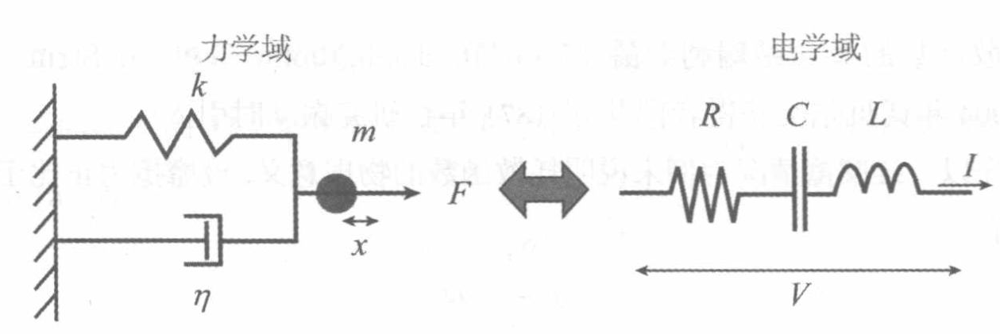

## 2203/11/29

### 1. Derivation of the Euler-Lagrange equation using the principle of least action 用最小作用量原理推导欧拉-拉格朗日方程

According to the definition of action, we have $$S = \int_{t_1}^{t_2} L(q, \dot{q}, t) \mathrm{d}t.$$

According to the principle of least action, we have $$\delta S = 0,$$ and under isochronic variation (等时变分, $\delta t = 0$) we get $$\begin{align*}
    \delta S & = \delta \int_{t_1}^{t_2} L(q, \dot{q}, t) \mathrm{d}t \\
    & = \int_{t_1}^{t_2} \left( {\partial L \over \partial q} \delta q + {\partial L \over \partial \dot{q}} \delta \dot{q} \right) \mathrm{d}t.
\end{align*}$$

Because in this condition, we have $\delta \dot{q} = \dfrac{\mathrm{d}}{\mathrm{d}t} \delta q$. Perform integration by parts, and we have $$\delta S = {\partial L \over \partial \dot{q}} \delta q \Bigg|_{t_1}^{t_2} + \int_{t_1}^{t_2} \left( {\partial L \over \partial q} \delta q + \dfrac{\mathrm{d}}{\mathrm{d}t} {\partial L \over \partial \dot{q}} \delta q \right) \mathrm{d}t = 0.$$

Because $\displaystyle {\partial L \over \partial \dot{q}} \delta q \Bigg|_{t_1}^{t_2} = 0$, $\displaystyle \int_{t_1}^{t_2} \left( {\partial L \over \partial q} \delta q + \dfrac{\mathrm{d}}{\mathrm{d}t} {\partial L \over \partial \dot{q}} \delta q \right) \mathrm{d}t$ should be zero for any $\delta q$. Consequently, for any coordinate, there should hold $${\partial L \over \partial q} + \dfrac{\mathrm{d}}{\mathrm{d}t} {\partial L \over \partial \dot{q}} = 0,$$ which is the Euler-Lagrange equations.

### 2. Cyclic/Ignorable coordinates 循环/可遗坐标

If the Lagrangian $L$ does not depend on some coordinate $q_\alpha$, it follows immediately from the Euler–Lagrange equations that $${\mathrm{d} p_\alpha \over \mathrm{d}t} = {\mathrm{d} \over \mathrm{d}t}{\partial L \over \partial \dot{q}_\alpha} = {\partial L \over \partial q_\alpha} = 0.$$

Integrate this, and we know that $$p_\alpha = \text{const}.$$

In this case, we call $q_\alpha$ **cyclic/ignorable coordinates (循环/可遗坐标)**, and the corresponding momentum is conserved.

In this case, generalized force $${\partial L \over \partial q_\alpha} = - {\partial U \over \partial q_\alpha},$$ and generalized momentum $${\partial L \over \partial \dot{q}_\alpha} = {\partial T \over \partial \dot{q}_\alpha}.$$

Two examples of cyclic coordinates:

- Kepler's problem 开普勒问题

    Suppose we have a central force field that follows the inverse square law (平方反比有心力场). In polar coordinates $r$ and $\theta$, we have the Lagrangian $$L = {1 \over 2} m \left( \dot{x}^2 + r^2 \dot{\theta}^2 \right) - \left( - {GMm \over r} \right).$$

    This Lagrangian does not include $\theta$, and $\theta$ is a cyclic/ignorable coordinate here.

    Thus, we now that the generalized momentum $$p_\theta = {\partial L \over \partial \dot{\theta}} = mr^2 \dot{\theta}$$

- Motion of a particle in a gravitational field 重力场中粒子的运动

    We have the Lagrangian $$L = {1 \over 2} m \left( \dot{x}^2 + \dot{y}^2 + \dot{z}^2 \right) - mgz,$$ which doesn't contain $x$ and $y$.

    From this we know that $$p_x = {\partial L \over \partial \dot{x}} = m \dot{x} = \text{const}$$ and $$p_y = {\partial L \over \partial \dot{y}} = m \dot{y} = \text{const}.$$

### 3. Metric tensors 度规张量

#### (1) Minkowski spacetime 闵可夫斯基时空

In Minkowski spacetime, the space-time interval can be written as $$\begin{align*}
    \mathrm{d} s^2 & = g_{\mu\nu} \mathrm{d}x^{\mu} \mathrm{d}x^{\nu} \\
    & = c^2 \mathrm{d}t^2 - \mathrm{d} x^2 - \mathrm{d} y^2 - \mathrm{d} z^2 \\
    & = c^2 \mathrm{d}t^2 \left[ 1 - \frac{1}{c^2} \left( \frac{\mathrm{d}x}{\mathrm{d}t} \right)^2 - \frac{1}{c^2} \left( \frac{\mathrm{d}y}{\mathrm{d}t} \right)^2 - \frac{1}{c^2} \left( \frac{\mathrm{d}z}{\mathrm{d}t} \right)^2 \right] \\[2ex]
    & = c^2 \mathrm{d}t^2 \left( 1 - {v^2 \over c^2} \right) \\[2ex]
    & = c^2 \mathrm{d} \tau^2,
\end{align*}$$

where $\mathrm{d} s^2$ stands for $(\mathrm{d} s)^2$.

From this we can see $$\mathbf{g} = \begin{pmatrix}
    1 & 0 & 0 & 0 \\
    0 & -1 & 0 & 0 \\
    0 & 0 & -1 & 0 \\
    0 & 0 & 0 & -1
\end{pmatrix}.$$

#### (2) Schwarzschild metric 史瓦西度规

*这个解是史瓦西在前线、在战壕里看爱因斯坦的文章学相对论时解出来的。*

The Schwarzschild metric is an exact solution to the Einstein field equations (爱因斯坦场方程) that describes the gravitational field outside a spherical mass: $$R_{\mu\nu} - {1 \over 2} g_{\mu\nu} R = {8 \pi G \over c^4} T_{\mu\nu}.$$

The solution is $$\mathrm{d}s^2 = \dfrac{1}{1 - \dfrac{r_s}{r}} \mathrm{d}r^2 + r^2 \mathrm{d} \theta^2 + r^2 \sin^2 \theta \mathrm{d} \varphi^2 - \left( 1 - \dfrac{r_s}{r} \right) c^2 \mathrm{d}t^2,$$ where $r_s$ is the Schwarzschild radius. It meets $${1 \over 2} m v^2 - {GMm \over r_s} = 0,$$ at velocity $v = c$. The Schwarzschild radius is $$r_s = {2GM \over c^2}.$$

Write the Schwarzschild metric in matrix form and we have $$\mathbf{g} = (g_{\mu\nu}) = \begin{pmatrix}
    \dfrac{1}{1 - \dfrac{r_s}{r}} & 0 & 0 & 0 \\[4ex]
    0 & r^2 & 0 & 0 \\
    0 & 0 & r^2 \sin^2 \theta & 0 \\[1ex]
    0 & 0 & 0 & - \left( 1 - \dfrac{r_s}{r} \right) \\[2ex]
\end{pmatrix}$$

#### (3) Spherical coordinates 球坐标

In this situation we have $\boldsymbol{r} = (r \sin \theta \cos \varphi, r \sin \theta \sin \varphi, r \cos \theta)$, or $$\mathrm{d} s^2 = \mathrm{d}r^2 + r^2 \mathrm{d} \theta^2 + r^2 \sin^2 \theta \mathrm{d} \varphi^2 = g_{\mu\nu} \mathrm{d}x^{\mu} \mathrm{d}x^{\nu}.$$

Thus, we have $$\frac{\partial \boldsymbol{r}}{\partial r} = (\sin \theta \cos \varphi, \sin \theta \sin \varphi, \cos \theta)$$ $$\frac{\partial \boldsymbol{r}}{\partial \theta} = (r \cos \theta \cos \varphi, r \cos \theta \sin \varphi, - r \sin \theta)$$ $$\frac{\partial \boldsymbol{r}}{\partial \varphi} = (- r \sin \theta \sin \varphi, r \sin \theta \cos \varphi, 0).$$

From this we know $$g_{rr} = (\sin \theta \cos \varphi)^2 + (\sin \theta \sin \varphi)^2 + (\cos \theta)^2 = 1,$$ $$g_{\theta \theta} = (r \cos \theta \cos \varphi)^2 + (r \cos \theta \sin \varphi)^2 + (- r \sin \theta)^2 = r^2,$$ $$g_{\varphi \varphi} = r^2 \sin^2 \theta.$$

$$\mathbf{g} = (g_{\mu\nu}) = \begin{pmatrix}
    1 & 0 & 0 \\
    0 & r^2 & 0 \\
    0 & 0 & r^2 \sin^2 \theta
\end{pmatrix}.$$

### 4. Mechanical–electrical analogy 力-电类比

We put a form here to fully represent this.

| Quantities & Functions | Mechanical System | Electrical System | Analogy |
| :--------------------: | :---------------: | :---------------: | :-----: |
| Kinetic energy    Potential energy    Lagrangian | $$T = {1 \over 2} m \dot{x}^2$$ $$V = {1 \over 2} kx^2$$ $$\mathcal{L}(x, \dot{x}) = {1 \over 2} m \dot{x}^2 - {1 \over 2} kx^2$$ | $$T = {1 \over 2} L \dot{Q}^2$$ $$V = {Q^2 \over 2C}$$ $$\mathcal{L}(Q, \dot{Q}) = {1 \over 2} L \dot{Q}^2 - {Q^2 \over 2C}$$ | $$m \Leftrightarrow L$$ $$k \Leftrightarrow {1 \over C}$$ $$x \Leftrightarrow Q$$ |
| Dissipation function | $$\mathcal{R} = {1 \over 2} \eta \dot{x}^2$$ | $$\mathcal{R} = {1 \over 2} R \dot{Q}^2 = {1 \over 2} RI^2$$ | $$\eta \Leftrightarrow R$$ $$\dot{x} \Leftrightarrow I = \dot{Q}$$ |
| Kinetic equations | $$m \ddot{x} + \eta \dot{x} + kx = 0$$ $$\ddot{x} + c \dot{x} + \omega_0^2 x = 0$$ $$\left( c = {\eta \over m}, \omega_0 = \sqrt{k \over m} \right)$$ | $$L \ddot{Q} + R \dot{Q} + {Q \over C} = 0$$ $$\ddot{Q} + \mu \dot{Q} + \omega_0^2 Q = 0$$ $$\left( \mu = {R \over L}, \omega_0 = \sqrt{1 \over LC} \right)$$ | $$c \Leftrightarrow \mu$$ |
| Quality factors | $$\mathcal{Q} = \frac{\sqrt{km}}{\mu}$$ | $$\mathcal{Q} = {1 \over R} \sqrt{L \over C}$$ | $$\eta \Leftrightarrow R$$ $$m \Leftrightarrow L$$ $$k \Leftrightarrow {1 \over C}$$ |
