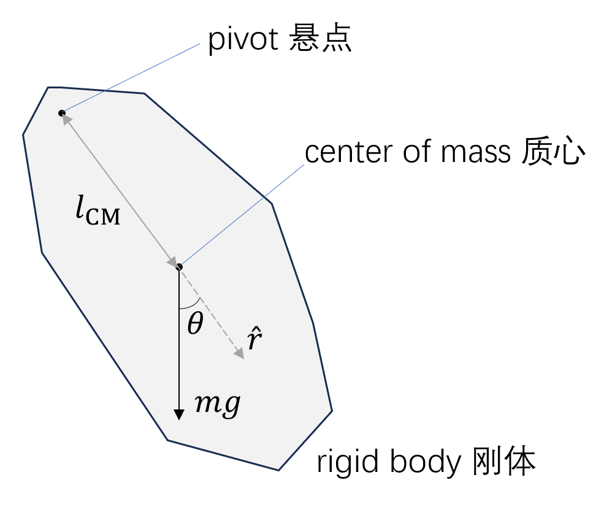

## 2023/12/11

*场论由Faraday于1865年提出，第一次运用是在笔记中出现了“field”这个词*

*7岁学习微积分的陶哲轩大神：“直觉” (intuition)*

### 1. Two paradigms for classical mechanics 经典力学的两大范式

**Paradigm I:** Newton's 1st principle (第一性原理)

**Paradigm II:** Kepler's big data (大数据)

Kepler's big data established paradigms for all subjects.

### 2. Data-driven (re)discovery of partial differential equations 数据驱动下对偏微分方程的（重）发现

From <i>Science Advances</i>, [<i>Data-driven discovery of partial differential equations</i>](https://doi.org/10.1126/sciadv.1602614)

Examples: 
- Navier-Stokes equations 纳维-斯托克斯方程 $$ {\partial \boldsymbol v \over \partial t} +(\boldsymbol v \cdot \nabla) \boldsymbol v = - {1 \over \rho} \nabla p + \mu \nabla^2 \boldsymbol v + \boldsymbol g$$
- Schrödinger Equation 薛定谔方程 $$-{ \hbar^2 \over 2m } \nabla ^2 \psi + U \psi =i\hbar {\partial \psi \over \partial t}$$ 
- Korteweg–De Vries equation 科特韦赫-德弗里斯方程/KdV方程 $$\partial_t \phi + \partial^3_x \phi - 6 \phi \partial_x \phi =0$$

### 3. Four paradigms 四种范式

For future reference, you can see the book [<i>The Fourth Paradigm: Data-intensive Scientific Discovery</i>](https://www.microsoft.com/en-us/research/uploads/prod/2009/10/Fourth_Paradigm.pdf) (2009).

| Order | Contents | Base |
| :----------------: | -------- | :--: |
| 1st Paradigm | Experimental-based empirical science | Experiments |
| 2nd Paradigm | Model-based theoretical science | Theoretical derivation |
| 3rd Paradigm | Simulation-based numerical science | Computer simulations |
| 4th Paradigm | Data-driven AI science | AI |

> 思考：第三点和第四点有什么区别？

### 4. AI for science 汤超院士：AI的三个层次

For the full text of Tang Chao's speech, please turn to the webpage [<i>2022科学智能峰会回顾｜汤超院士：关于AI for Science的几层意思</i>](http://www.aais.pku.edu.cn/news/shownews.php?id=1493) for reference.

*译者注：此部分先放中文在放英文，是因为原文为中文*

Tang Chao pointed out that there are 3 levels of AI application nowadays:

1. 将深度学习技术用于各个学科中的科研、技术创新、成果转化等
    
    Applying deep learning technology to scientific research, technological innovation, and achievement transformation in various disciplines

2. 利用AI来发现new science

    Using AI to discover "new science"

3. AI背后的科学原理

    Science of AI 

Articles like [<i>Rediscovering orbital mechanics with machine learning</i>](https://doi.org/10.1088/2632-2153/acfa63) have pointed out that machine learning can be used to analyze big data and rediscover theorems in classical mechanics.

Researchers in the classical mechanics field should pay attention to such advancements in AI and not stay away from them. 

### 5. Physical pendulum 物理摆

#### (1) Random-shaped physical pendulum 一般的摆

The gravity of the pendulum is $$m\boldsymbol{g} = mg (\cos \theta \hat{\boldsymbol{r}} - \sin \theta \hat{\boldsymbol{\theta}}).$$

The torque $$\begin{align*}
    \boldsymbol{M} & = \boldsymbol{r} \times m \boldsymbol{g} \\
    & = l_{\text{CM}} \hat{\boldsymbol{r}} \times mg (\cos \theta \hat{\boldsymbol{r}} - \sin \theta \hat{\boldsymbol{\theta}}) \\
    & = - l_{\text{CM}} mg \sin \theta \hat{\boldsymbol{k}}.
\end{align*}$$

According to the angular momentum theorem, we have $$\boldsymbol{M} = - l_{\text{CM}} mg \sin \theta \hat{\boldsymbol{k}} = I \frac{\mathrm{d}^2 \theta}{\mathrm{d}t^2} \hat{\boldsymbol{k}}$$ $$I \ddot{\theta} + mgl_{\text{CM}} \sin \theta = 0.$$

When $\theta \ll 1$, $$\ddot{\theta} + \frac{mgl_{\text{CM}}}{I} \theta = 0.$$

#### (2) Torsional pendulum 扭摆

*编者吐槽：这图不会画*

Let the equilibrium position be $\theta = 0$, and we know the torque $$M = - k \theta.$$

Also, according to the angular momentum theorem, $M = I \ddot{\theta}$, and we have $$I \ddot{\theta} + k \theta = 0$$ $$\ddot{\theta} + \frac{k}{I} \theta = 0.$$

### 6. Principle of virtual work/displacement 虚功/位移原理

In a system with degree of freedom $n$, we can write the position of a particle $$\boldsymbol{r} = \boldsymbol{r}(q_1, q_2, \dots, q_n; t).$$

Take the time derivative of $\boldsymbol{r}$ and we get $$\boldsymbol{v} = \frac{\mathrm{d} \boldsymbol{r}}{\mathrm{d}t} = \frac{\partial \boldsymbol{r}}{\partial t} + \sum_{i = 1}^{n} \frac{\partial \boldsymbol{r}}{\partial q_i} \frac{\mathrm{d} q_i}{\mathrm{d}t}.$$

For a mechanical system at equilibrium, we know that $$\delta W = \sum_{i = 1}^{s} \boldsymbol{F}_i \cdot \delta \boldsymbol{r}_i = \sum_{i = 1}^{n} \boldsymbol{F}_i \cdot \left( \sum_{j = 1}^{n} \frac{\partial \boldsymbol{r}_i}{\partial q_j} \delta q_j \right) = 0,$$ where $s$ is the number of external forces applied on the system.

For each force $\boldsymbol{F}_i$, there is a corresponding generalized force $$Q_i = \sum_{j = 1}^{n} \boldsymbol{F}_i \cdot \frac{\partial \boldsymbol{r}_i}{\partial q_j}.$$

Also, we know that there are two types of forces: **active forces (主动力)** and **constraint forces (约束力)**: $$\boldsymbol{F}_i = \boldsymbol{F}_i^{\text{(a)}} + \boldsymbol{F}_i^{\text{(c)}},$$ and we can break $\delta W$ into 2 parts: $$\delta W = \sum_{i = 1}^{n} \sum_{j = 1}^{n} \boldsymbol{F}_i^{\text{(a)}} \cdot \frac{\partial \boldsymbol{r}_i}{\partial q_j} \delta q_j + \underline{\sum_{i = 1}^{n} \sum_{j = 1}^{n} \boldsymbol{F}_i^{\text{(c)}} \cdot \frac{\partial \boldsymbol{r}_i}{\partial q_j} \delta q_j}.$$

The underlined part (the work of the constraint forces) is usually $0$, and we only need to calculate the first part. That is, $$\sum_{i = 1}^{n} \sum_{j = 1}^{n} \boldsymbol{F}_i^{\text{(a)}} \cdot \frac{\partial \boldsymbol{r}_i}{\partial q_j} \delta q_j = 0.$$
