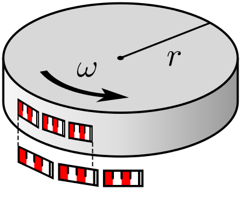

## 2023/12/20

*做出任何选择都要进行风险评估。可能的风险包括但不限于政策风险、技术风险、资金风险等。*

### 1. Earthquakes 地震

*编者按：据中国地震台网消息，2023年12月18日23时59分，甘肃省临夏回族自治州积石山保安族东乡族撒拉族自治县发生6.2级地震。习近平总书记对此作出重要指示：全力开展搜救，妥善安置受灾群众。*

In 1997, <i>Science</i> published [*Earthquakes Cannot Be Predicted*](https://doi.org/10.1126/science.275.5306.1616), and till this day, no one has raised any objections against the viewpoint.

*地震局的人，坐在宽敞的办公室，吃饭睡觉写文章，写出的文章也只能引用美国研究的观点，但也不能成功预报出地震。*

The happening of earthquakes is a chaotic system (混沌系统), and thus difficult to predict. The abstract of the article above states:

> Can the time, location, and magnitude of future earthquakes be predicted reliably and accurately? In their Perspective, Geller et al.'s answer is “no.” **Citing recent results from the physics of nonlinear systems “chaos theory,” they argue that any small earthquake has some chance of cascading into a large event. According to research cited by the authors, whether or not this happens depends on unmeasurably fine details of conditions in Earth's interior.** Earthquakes are therefore inherently unpredictable. Geller et al. suggest that controversy over prediction lingers because prediction claims are not stated as objectively testable scientific hypotheses, and due to overly optimistic reports in the mass media.

In 2018, <i>Nature</i> published [*Deep learning of aftershock patterns following large earthquakes*](https://doi.org/10.1038/s41586-018-0438-y), marking a new era of earthquake studies using AI technology.

*聪明的人已经在做数据库来让AI学习了！*

### 2. Phase space 相空间

$$H = \sum_{j = 1}^{s} \frac{\partial L}{\partial \dot{q}_j} \dot{q}_j - L = 2T - (T - V) = T + V.$$

*编者按：不知道这个式子跟上下两个部分有什么关系，随便找个地方写一下（doge）*

#### (1) Introduction 简介

*Arnold: 相空间是现代科学最强的发明之一 (one of the most powerful inventions of modern science)*

In the theory of phase space, there are a couple of concepts:
- Phase space ($\Gamma$-space, Phasenraum, 相空间): a space of $2s$ dimensions ($s$ generalized coordinates $q_j$ and $s$ generalized momentums $p_j$) (以体系的 $s$ 个广义坐标 $q_j$ 和 $s$ 个广动量 $p_j$ 为坐标轴的 $2s$ 维假想的空间).
- Phase point ($\Gamma$-point, 相点): a particular point in the phase space, representing a state of the object studied.
- Phase plane (相平面): a phase space of only $2$ dimensions.
- Phase volume (相体积): similar to the definition of volume in real space. A unit volume of the phase space is $$\mathrm{d}\varGamma = \mathrm{d}q_1 \mathrm{d}q_2 \dots \mathrm{d}q_s \mathrm{d}p_1 \mathrm{d}p_2 \dots \mathrm{d}p_s.$$
- Phase area (相面积): phase volume of space with only 2 dimensions.

#### (2) Liouville's theorem 刘维尔定理

**Liouville's theorem (刘维尔定理)** states that the phase volume of a phase space of a conservative system is conserved (保守系统的相体积守恒). We provide the proof below:

For a phase point $x(q, p)$ in a 2-dimensional phase space, we can get its phase velocity $$\frac{\mathrm{d}x}{\mathrm{d}t} = (\dot{q}, \dot{p}) = \left( \frac{\partial H}{\partial p}, - \frac{\partial H}{\partial q} \right).$$

According to the Gauss's divergence theorem (高斯散度定理) $$\iiint (\nabla \cdot \boldsymbol{F}) \mathrm{d}V = \oiint_{\partial V} \boldsymbol{F} \cdot \mathrm{d} \boldsymbol{S},$$ we know that $$\oint \frac{\mathrm{d}x}{\mathrm{d}t} \cdot \mathrm{d}A = \iint \operatorname{div} \frac{\mathrm{d}x}{\mathrm{d}t} \mathrm{d}V.$$

On the basis that $H$ is 2nd-order smooth, we have $$\operatorname{div} \frac{\mathrm{d}x}{\mathrm{d}t} = \frac{\partial}{\partial q} \frac{\partial H}{\partial p} + \frac{\partial}{\partial p} \left( - \frac{\partial H}{\partial q} \right) = \frac{\partial^2 H}{\partial q \partial p} - \frac{\partial^2 H}{\partial p \partial q} = 0.$$

Similarly, for a $2s$-dimensional phase space, we have $x = x(q_1, p_1; q_2, p_2; \dots; q_n, p_n)$, and $$\begin{align*}
    \operatorname{div} \frac{\mathrm{d}x}{\mathrm{d}t} & = \sum_{j = 1}^{s} \left[ \frac{\partial}{\partial q_j} \frac{\partial H}{\partial p_j} + \frac{\partial}{\partial p_j} \left( - \frac{\partial H}{\partial q_j} \right) \right] \\
    & = \sum_{j = 1}^{s} \left( \frac{\partial^2 H}{\partial q_j \partial p_j} - \frac{\partial^2 H}{\partial p_j \partial q_j} \right) \\
    & \overset{\text{2nd-order smooth}}{=\!=\!=\!=\!=\!=\!=\!=\!=\!=\!=} 0.
\end{align*}$$

*做研究要靠的是你的思想，而不能只靠文献。课题要从生活中来，就像 Feynman 提出的“三段式意大利面”一样，但不能从文献中来。*

### 3. Lorentz transformation 洛伦兹变换

#### (1) Basic forms 基本形式

The basic form of the Lorentz transformation is $$\left\{
    \begin{array}{l}
        \displaystyle x' = \gamma \left( x - vt \right), \\
        \displaystyle y' = y, \\
        \displaystyle z' = z, \\
        \displaystyle t' = \gamma \left( t - \frac{vx}{c^2} \right),
    \end{array}
\right.$$ where $\displaystyle \gamma=\frac{1}{\sqrt{1 - \displaystyle \frac{v^2}{c^2}}}$.

Also from this we can have $$\begin{align*}
    \mathrm{d} s^2 & = c^2 \mathrm{d}t^2 - \mathrm{d} x^2 - \mathrm{d} y^2 - \mathrm{d} z^2 = g_{\mu\nu} \mathrm{d}x^{\mu} \mathrm{d}x^{\nu} \\
    & = c^2 \mathrm{d}t^2 \left( 1 - \frac{\dot{x}^2 + \dot{y}^2 + \dot{z}^2}{c^2} \right) \\
    & = c^2 \mathrm{d}t^2 \left( 1 - {v^2 \over c^2} \right) \\
    & = c^2 \mathrm{d} \tau^2,
\end{align*}$$ where $\tau$ is the **proper time (固有时)**, and $$\frac{\mathrm{d}t}{\mathrm{d} \tau} = \gamma = \frac{1}{\sqrt{1 - \dfrac{v^2}{c^2}}}.$$

#### (2) Lorentz inverse transformation 洛伦兹反变换

*译者注：应为inverse，赵老师上课错写成reverse。*

Lorentz inverse transformation is the transformation from $S'$ back to $S$, different from the Lorentz transformation above ($S$ to $S'$). According to the principle of relativity (相对性原理), the form of the Lorentz reverse transformation can be acquired by mapping $v \mapsto -v$ and exchanging $x$, $y$, $z$, $t$ and $x'$, $y'$, $z'$, $t$. The form is: $$\left\{
    \begin{array}{l}
        \displaystyle x = \gamma \left( x' + vt' \right), \\
        \displaystyle y = y', \\
        \displaystyle z = z', \\
        \displaystyle t = \gamma \left( t' + \frac{vx'}{c^2} \right).
    \end{array}
\right.$$

#### (3) Length contraction 尺缩效应

We measure the positions of 2 points in reference frame (参考系) $S'$ simultaneously (同时地) and compare them to that in reference frame $S$.

From the inverse transformation, we have $$x_2 - x_1 = \gamma \left[ x_2' - x_1' + v(t_2' - t_1') \right].$$

In this scenario, because the measurement is made at the same time, we have $t_1' = t_2'$, and $x_2 - x_1 = \gamma \left( x_2' - x_1' \right)$.

Let the length in reference frame $S$ and $S'$ be $L_0$ and $L$ respectively. And thus we have $$L = \frac{1}{\gamma} L_0 = L_0 \sqrt{1 - \frac{v^2}{c^2}}.$$

This shows us that **length contraction (尺缩效应)** happens along the moving direction and not on directions perpendicular to the moving direction.

#### (4) Metrics about the Ehrenfest paradox 埃伦费斯特悖论相关的度规

From length contraction, Paul Ehrenfest proposed the **Ehrenfest paradox (埃伦费斯特悖论)** in 1909: 

> Imagine a disk of radius $R$ rotating with constant angular velocity $\omega$:
>
> 
>
> The reference frame is fixed to the stationary center of the disk. Then the magnitude of the relative velocity of any point in the circumference of the disk is $\omega R$. So the circumference should undergo length contraction by a factor of $\sqrt{1-(\omega R)^2/c^2}$.
>
> However, since the radius is perpendicular to the direction of motion, it will not undergo any contraction. So $$\frac{\mathrm{circumference}}{\mathrm{diameter}}=\frac{2\pi R \sqrt{1-(\omega R)^2/c^2}}{2R} = \pi \sqrt{1-(\omega R)^2/c^2}.$$ This is paradoxical, since in accordance with Euclidean geometry, it should be exactly equal to $\pi$.

The description above is taken from [*Wikipedia: Ehrenfest paradox*](https://en.wikipedia.org/w/index.php?title=Ehrenfest_paradox&oldid=1182372365).

We can use another metric (张量) to analyze the Ehrenfest paradox. The metric is $$\mathrm{d}s^2 = \mathrm{d}r^2 + r^2 \mathrm{d}\theta^2 - c^2 \mathrm{d}t^2.$$

Substitute the relationship between reference frames $S$ and $S'$ $$\left\{
    \begin{array}{l}
        r' = r \\
        \theta' = \theta - \omega t \\
        t' = t
    \end{array}
\right.$$ in, and we get $$\begin{align*}
    \mathrm{d}s^2 & = \mathrm{d}r'^2 + r'^2 \left( \mathrm{d}\theta' + \omega \mathrm{d}t \right)^2 - c^2 \mathrm{d}t'^2 \\
    & = \mathrm{d}r'^2 + r'^2 \mathrm{d}\theta'^2 + 2 \omega r'^2 \mathrm{d}\theta' \mathrm{d}t - c^2 \left( 1 - \frac{r'^2 \omega^2}{c^2} \right) \mathrm{d}t'^2.
\end{align*}$$

Write this in tensor form, and we get $$\mathrm{d} s^2 = g_{\mu\nu} \mathrm{d}x^{\mu} \mathrm{d}x^{\nu},$$ where $$\mathbf{g} = (g_{\mu\nu}) = \begin{pmatrix}
    1 & 0 & 0 \\
    0 & r'^2 & 2 \omega r'^2 \\
    0 & 0 & - c^2 \left( 1 - \dfrac{r'^2 \omega^2}{c^2} \right)
\end{pmatrix}.$$

#### (5) Minkowski spacetime 闵可夫斯基时空

In Minkowski spacetime, we express a point within it in this form: $$\boldsymbol{r} = (ct, x, y, z).$$ This is an expression of the world line (世界线), which is the path that an object traces in 4-dimensional spacetime.

From $\boldsymbol{r}$ we can calculate its velocity $$\boldsymbol{v} = \frac{\mathrm{d} \boldsymbol{r}}{\mathrm{d} \tau} = \frac{\mathrm{d} \boldsymbol{r}}{\mathrm{d}t} \frac{\mathrm{d}t}{\mathrm{d} \tau} = \gamma \frac{\mathrm{d} \boldsymbol{r}}{\mathrm{d}t} = \gamma (c, \dot{x}, \dot{y}, \dot{z}),$$ and thus acceleration $$\begin{align*}
    \boldsymbol{a} & = \frac{\mathrm{d} \boldsymbol{v}}{\mathrm{d} \tau} = \frac{\mathrm{d} \boldsymbol{v}}{\mathrm{d}t} \frac{\mathrm{d}t}{\mathrm{d} \tau} = \gamma \frac{\mathrm{d} \boldsymbol{v}}{\mathrm{d}t} \\
    & = \gamma \frac{\mathrm{d}}{\mathrm{d}t} \Big[ \gamma \left( c, \dot{x}, \dot{y}, \dot{z} \right) \Big] \\
    & = \gamma \left[ \gamma (0, \ddot{x}, \ddot{y}, \ddot{z}) + \left( c, \dot{x}, \dot{y}, \dot{z} \right) \frac{\mathrm{d} \gamma}{\mathrm{d}t} \right].
\end{align*}$$

Here, $$\begin{align*}
    \frac{\mathrm{d} \gamma}{\mathrm{d}t} & = \frac{\mathrm{d}}{\mathrm{d}t} \left( 1 - \frac{\dot{x}^2 + \dot{y}^2 + \dot{z}^2}{c^2} \right)^{- 1/2} \\
    & = - \frac{1}{2} \left( 1 - \frac{\dot{x}^2 + \dot{y}^2 + \dot{z}^2}{c^2} \right)^{- 3/2} \left( - \frac{2 \dot{x} \ddot{x} + 2 \dot{y} \ddot{y} + 2 \dot{z} \ddot{z}}{c^2} \right) \\
    & = \frac{\dot{x} \ddot{x} + \dot{y} \ddot{y} + \dot{z} \ddot{z}}{c^2} \gamma^3.
\end{align*}$$

Substitute $\displaystyle \frac{\mathrm{d} \gamma}{\mathrm{d}t}$ into acceleration, and we acquire $$\begin{align*}
    \boldsymbol{a} ={} & \gamma^2 (0, \ddot{x}, \ddot{y}, \ddot{z}) + \left( c, \dot{x}, \dot{y}, \dot{z} \right)\frac{\dot{x} \ddot{x} + \dot{y} \ddot{y} + \dot{z} \ddot{z}}{c^2} \gamma^4 \\
    ={} & \biggl(  \frac{\dot{x} \ddot{x} + \dot{y} \ddot{y} + \dot{z} \ddot{z}}{c} \gamma^4, \gamma^2 \ddot{x} + \frac{\dot{x} \ddot{x} + \dot{y} \ddot{y} + \dot{z} \ddot{z}}{c^2} \gamma^4 \dot{x}, \\
    & \gamma^2 \ddot{y} + \frac{\dot{x} \ddot{x} + \dot{y} \ddot{y} + \dot{z} \ddot{z}}{c^2} \gamma^4 \dot{y}, \gamma^2 \ddot{z} + \frac{\dot{x} \ddot{x} + \dot{y} \ddot{y} + \dot{z} \ddot{z}}{c^2} \gamma^4 \dot{z} \biggr).
\end{align*}$$

From this, we can get 4-dimensional force $$\begin{align*}
    \boldsymbol{F} = m \boldsymbol{a} = m & \biggl(  \frac{\dot{x} \ddot{x} + \dot{y} \ddot{y} + \dot{z} \ddot{z}}{c} \gamma^4, \gamma^2 \ddot{x} + \frac{\dot{x} \ddot{x} + \dot{y} \ddot{y} + \dot{z} \ddot{z}}{c^2} \gamma^4 \dot{x}, \\
    & \gamma^2 \ddot{y} + \frac{\dot{x} \ddot{x} + \dot{y} \ddot{y} + \dot{z} \ddot{z}}{c^2} \gamma^4 \dot{y}, \gamma^2 \ddot{z} + \frac{\dot{x} \ddot{x} + \dot{y} \ddot{y} + \dot{z} \ddot{z}}{c^2} \gamma^4 \dot{z} \biggr).
\end{align*}$$

#### (6) Deduction of relativistic Lagrangian 相对论拉格朗日方程的推导

Generalized momentum $$p = m \frac{\mathrm{d} \boldsymbol{q}}{\mathrm{d} \tau} = \gamma m \dot{q} = \frac{m \dot{q}}{\sqrt{1 - \dot{q}^2 / c^2}}. \quad(1)$$

By definition we know that $$p \equiv \frac{\partial L}{\partial \dot{q}}.$$

Considering that: (a) $L = T - V$, (b) $V(q_1, q_2, \dots, q_s)$ does not depend on $\dot{q}_j$ and (c) $T(\dot{q}_1, \dot{q}_2, \dots, \dot{q}_s)$ does not depend on $q_j$, we can say that $$p \equiv \frac{\partial \left( L + V \right)}{\partial \dot{q}} = \frac{\partial T}{\partial \dot{q}} = \frac{\mathrm{d} T}{\mathrm{d} \dot{q}}. \quad(2)$$

From $(1)$ and $(2)$, we can acquire an equation for Lagrangian $L$: $$\frac{\mathrm{d} T}{\mathrm{d} \dot{q}} = \frac{m \dot{q}}{\sqrt{1 - \dot{q}^2 / c^2}}.$$

Solve this: $$\mathrm{d} T = \frac{m \dot{q} \mathrm{d} \dot{q}}{\sqrt{1 - \dot{q}^2 / c^2}} = \frac{m \mathrm{d}\left( \dot{q}^2 \right)}{2 \sqrt{1 - \dot{q}^2 / c^2}} = - \frac{1}{2} mc^2 \mathrm{d} \left( 2 \sqrt{1 - \frac{\dot{q}^2}{c^2}} \right) = - mc^2 \mathrm{d} \sqrt{1 - \frac{\dot{q}^2}{c^2}}.$$

Integrate this, we can get $$T = - mc^2 \sqrt{1 - \frac{\dot{q}^2}{c^2}}.$$

Thus the Lagrangian $$L = T - V = - mc^2 \sqrt{1 - \frac{\dot{q}^2}{c^2}} - V.$$

> 作业：推导 $H = \gamma mc^2 + V$.
>
> 答案：$$\begin{align*}
    H & = p \dot{q} - L \\
    & = \frac{m \dot{q}}{\sqrt{1 - \dot{q}^2 / c^2}} \dot{q} - \left( - mc^2 \sqrt{1 - \frac{\dot{q}^2}{c^2}} - V \right) \\
    & = \frac{m \dot{q}^2}{\sqrt{1 - \dot{q}^2 / c^2}} + \frac{mc^2 \left( 1 - \dfrac{\dot{q}^2}{c^2} \right)}{\sqrt{1 - \dot{q}^2 / c^2}} + V \\
    & = \frac{m c^2}{\sqrt{1 - \dot{q}^2 / c^2}} + V \\
    & = \gamma mc^2 + V.
\end{align*}$$
