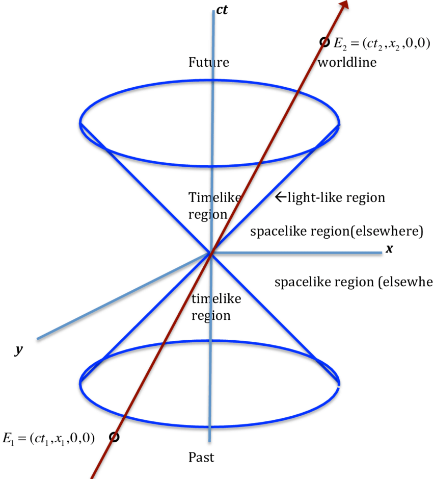

## 2023/12/25

### 1. Relationships between events in Minkowski spacetime 闵可夫斯基时空中的事件关系

Suppose in Minkowski spacetime, we have 2 events, for example, $(ct_1, x_1, y_1, z_1)$ and $(ct_2, x_2, y_2, z_2)$. Then, the spacetime interval (时空间隔) between the two events is $$\Delta s^2 = (c \Delta t)^2 - \Delta x^2 - \Delta y^2 - \Delta z^2 = c^2 \Delta t^2 - \Delta \boldsymbol{r}^2,$$ where $\Delta \boldsymbol{r}$ is the three-dimensional spatial distance between the events, the time interval is $c\Delta t$ and the three spatial intervals are $\Delta x$, $\Delta y$, $\Delta z$.

In that case, comparing $\Delta s^2$ with $0$ seems to be comparing the distance light travels between the occurrence of the events with their spatial separation. We now have the following definitions:

- If $\Delta s^2 > 0$, or $c^2 \Delta t^2 > \Delta \boldsymbol{r}^2$, the spatial separation is less than the distance light travels and the interval is called **timelike**.
- If $\Delta s^2 = 0$, or $c^2 \Delta t^2 = \Delta \boldsymbol{r}^2$, the spatial separation is equal to the distance light travels and the interval is called **lightlike**.
- If $\Delta s^2 < 0$, or $c^2 \Delta t^2 < \Delta \boldsymbol{r}^2$, the spatial separation is greater than the distance light travels and the interval is called **spacelike**.

Below is an illustration of the timelike, spacelike, and lightlike regions in Minkowski spacetime. In the illustration, the $z$-axis is eliminated for the convenience of drawing.

*相对论的建立中，洛伦兹、庞加莱、闵可夫斯基等人都有杰出贡献，但最终认为爱因斯坦才是相对论的代表性人物，因为只有他形成了相对论中全链条的理论体系。*

### 2. Further into relativity 相对论的进一步探讨

#### (1) Postulates in special relativity 狭义相对论的公设

An **axiom (公理)** or **postulate (公设)** is a statement that is taken to be true, to serve as a premise or starting point for further reasoning and arguments. The difference between these two is that axioms are statements taken to be true in **all subjects**, while postulates are statements taken to be true in **only a particular subject**.

The two postulates in Einstein's special relativity are:

1. The laws of physics have the same form in all inertial reference frames.
2. Light propagates through empty space with a definite speed $c$ independent of the speed of the observer (or source).

Last time, we talked about length contraction, which states that $$L = L_0 \sqrt{1 - \frac{v^2}{c^2}}.$$

> 作业：贝尔飞船佯谬是什么？

Max Born (波恩) put up with the problem of **Born rigidity**: if the length of a rigid body would contract at high speeds, why is it a rigid body?

There is strain (应变) as its definition $$\varepsilon \overset{\text{def}}{=\!=} \frac{L - L_0}{L_0} = \sqrt{1 - \frac{v^2}{c^2}} - 1 \overset{v \ll c}{=\!=\!=} - \frac{v^2}{2 c^2},$$ and stress (应力) $$\sigma = \varepsilon E = - E \frac{v^2}{2 c^2},$$ where $E$ is the Young's modulus of the material.

*从这里可以看出，这里应该是有力的，那么这到底是不是刚体？赵爹说，这是个科学哲学问题，下节课找两个同学辩论一下。*

#### (2) Time dilation 时间膨胀

We suppose that there are 2 frames of reference $S$ and $S'$, and $S'$ is moving at a velocity $\boldsymbol{v}$ relative to $S$. 

Consider 2 events at the same location in $S$ happening at $(t_1, x_1)$ and $(t_2, x_2)$, where $x_1 = x_2$.

According to the Lorentz transformations, we have $$t' = \gamma \left( t - \frac{vx}{c^2} \right),$$ and with these two events we get $$t_2' - t_1' = \gamma \left[ t_2 - t_1 - \frac{v(x_2 - x_1)}{c^2} \right] = \gamma (t_2 - t_1).$$

Here $\Delta \tau = t_2 - t_1$ is called **proper time (固有时)**, and it means the time lapse between the two events in a frame of reference (stationary frame) in which the two events happen at the same location. The time measured in a frame of reference which has a velocity relative to the stationary frame is greater than the proper time. Thus the duration of the clock cycle of a moving clock is found to be increased: it is measured to be "running slow", and that's where the name "time dilation" comes from.

### 3. Symplectic matrices 辛矩阵

#### (1) Comparing different formulations of classical mechanics 对比经典力学的不同表述

| Formulations | Newtonian mechanics | Lagrangian mechanics | Hamiltonian mechanics | Equivalency |
| :----------: | :-----------------: | :------------------: | :-------------------: | :---------: |
| Physical contrast | $$\boldsymbol{F} = \frac{\mathrm{d}p}{\mathrm{d}t}$$ | $$\frac{\partial L}{\partial q_j} - \frac{\mathrm{d}}{\mathrm{d}t} \frac{\partial L}{\partial \dot{q}_j} = 0$$ | $$\left\{ \begin{aligned} \frac{\partial H}{\partial q_j} &= -\dot{p}_j, \\[2ex] \frac{\partial H}{\partial p_j} &= \dot{q}_j \end{aligned} \right.$$ | Physically equivalent (物理上等价) |
| Mathematical contrast | Euclidean geometry | Riemann geometry | Symplectic geometry | Mathematically not equivalent (数学上不等价) |

#### (2) Symplectic matrix 辛矩阵

Hermann Weyl developed the theory of **symplectic matrices (辛矩阵)**, which write the Hamiltonian canonical equations (as shown in the table above) in matrix form (one-degree): $$\begin{pmatrix}
	\dot{q} \\
    \dot{p}
\end{pmatrix} = \begin{pmatrix}
    0 & 1 \\
    -1 & 0
\end{pmatrix} \begin{pmatrix}
    \displaystyle \frac{\partial H}{\partial q} \\[2ex]
    \displaystyle \frac{\partial H}{\partial p}
\end{pmatrix}$$

If there are $n$ generalized coordinates, the form of the symplectic matrix would be $$\begin{align*}
    \begin{pmatrix}
        \dot{q}_1 \\
        \dot{q}_2 \\
        \vdots \\
        \dot{q}_n \\
        \dot{p}_1 \\
        \dot{p}_2 \\
        \vdots \\
        \dot{p}_n
    \end{pmatrix} & = \begin{pmatrix}
        0 & 0 & \cdots & 0 & 1 & 0 & \cdots & 0 \\
        0 & 0 & \cdots & 0 & 0 & 1 & \cdots & 0 \\
        \vdots & \vdots & \ddots & \vdots & \vdots & \vdots & \ddots & \vdots \\
        0 & 0 & \cdots & 0 & 0 & 0 & \cdots & 1 \\
        -1 & 0 & \cdots & 0 & 0 & 0 & \cdots & 0 \\
        0 & -1 & \cdots & 0 & 0 & 0 & \cdots & 0 \\
        \vdots & \vdots & \ddots & \vdots & \vdots & \vdots & \ddots & \vdots \\
        0 & 0 & \cdots & -1 & 0 & 0 & \cdots & 0 \\
    \end{pmatrix}_{2n \times 2n} \begin{pmatrix}
        \partial H / \partial q_1 \\
        \partial H / \partial q_2 \\
        \vdots \\
        \partial H / \partial q_n \\
        \partial H / \partial p_1 \\
        \partial H / \partial p_2 \\
        \vdots \\
        \partial H / \partial p_n \\
    \end{pmatrix}  \\
    & = \begin{pmatrix}
        \mathbf{0}_n & \mathbf{I}_n \\
        - \mathbf{I}_n & \mathbf{0}_n
    \end{pmatrix} \begin{pmatrix}
        \partial H / \partial q_1 \\
        \partial H / \partial q_2 \\
        \vdots \\
        \partial H / \partial q_n \\
        \partial H / \partial p_1 \\
        \partial H / \partial p_2 \\
        \vdots \\
        \partial H / \partial p_n \\
    \end{pmatrix}.  \\
\end{align*}$$

### 4. Relativistic energy-time relationships 能量-动量关系

#### (1) Hamiltonian under relativistic conditions 相对论条件下的哈密顿量

From last class, we know that $$L = T - V = - mc^2 \sqrt{1 - \frac{\dot{q}^2}{c^2}} - V.$$

THus, using Legendre transformation, we get $$\begin{align*}
    H & = p \dot{q} - L \\
    & = \frac{m \dot{q}}{\sqrt{1 - \dot{q}^2 / c^2}} \dot{q} - \left( - mc^2 \sqrt{1 - \frac{\dot{q}^2}{c^2}} - V \right) \\
    & = \frac{m \dot{q}^2}{\sqrt{1 - \dot{q}^2 / c^2}} + \frac{mc^2 \left( 1 - \dfrac{\dot{q}^2}{c^2} \right)}{\sqrt{1 - \dot{q}^2 / c^2}} + V \\
    & = \frac{m c^2}{\sqrt{1 - \dot{q}^2 / c^2}} + V \\
    & = \gamma mc^2 + V.
\end{align*}$$

Let the potential energy $V$ be $0$, and we get the form of the Hamiltonian under relativistic conditions: $$H = \gamma mc^2.$$

#### (2) Dirac energy-motion relation 狄拉克动量-能量关系

If the mass of a particle when stationary (invariant/proper mass, 固有质量) is $m_0$, then under relativistic conditions its mass would become $m = \gamma m_0$. Thus, the total energy of the particle is $$\begin{align*}
    E^2 & = m^2 c^4 = \gamma^2 m_0^2 c^4\\
    & = \frac{m_0^2 c^4}{1 - \dfrac{v^2}{c^2}} \\
    & = \frac{\displaystyle m_0^2 c^4 \left( 1 - \frac{v^2}{c^2} + \frac{v^2}{c^2} \right)}{1 - \dfrac{v^2}{c^2}} \\ 
    & = m_0^2 c^4 + \frac{m_0^2 c^2 v^2}{1 - \dfrac{v^2}{c^2}} \\
    & = m_0^2 c^4 + \left( \frac{m_0 v}{\sqrt{1 - v^2 / c^2}} \right)^2 c^2 \\
    & = m_0^2 c^4 + p^2 c^2,
\end{align*}$$ which is the energy-momentum relation.

#### (3) Klein-Gordon equation 克莱因-戈尔登方程

We already know the momentum and energy operators in quantum mechanics: $$\hat{\boldsymbol{p}} = - \mathrm{i} \hbar \nabla \quad \text{and} \quad \hat{E} = \mathrm{i} \hbar \frac{\partial}{\partial t}.$$

Operatorize the energy-momentum relation, and we get $$E^2 \psi = (m_0^2 c^4 + p^2 c^2) \psi$$ $$\hat{E}^2 \psi = (m_0^2 c^4 + \hat{\boldsymbol{p}} \cdot \hat{\boldsymbol{p}} c^2) \psi$$ $$\left( \mathrm{i} \hbar \frac{\partial}{\partial t} \right)^2 \psi = \left[ \left( {i} \hbar \nabla \cdot {i} \hbar \nabla \right) c^2 + m_0^2 c^4 \right] \psi$$ $$- \hbar^2 \frac{1}{c^2} \frac{\partial^2 \psi}{\partial t^2} = \left( - \hbar^2 \nabla^2 + m_0^2 c^2 \right) \psi$$ $$\left( \frac{1}{c^2} \frac{\partial^2 }{\partial t^2} - \nabla^2 \right) \psi + \left( \frac{m_0c}{\hbar} \right)^2 \psi = 0.$$

Substitute $\displaystyle \frac{1}{c^2} \frac{\partial^2 }{\partial t^2} - \nabla^2 = \Box$ and $\displaystyle \frac{m_0c}{\hbar} = \mu$ in, and we get $$\left( \Box + \mu^2 \right) \psi = 0.$$

The Klein-Gordon equation can reflect relativistic effects (能反映相对论效应), but the second-order derivative with respect to time contained in it makes it unable to reflect quantum behavior (反映量子行为).

*薛定谔：这个方程里面有时间的二阶导、没有虚数单位 ${\mathrm{i}}$，我不喜欢，我不发表。*

*克莱因、戈尔登：你嫌弃，我们喜欢啊！于是发表。*

### 5. Comparison between classical mechanics and special relativity 经典力学和狭义相对论的对比

Below, we compare classical mechanics and special relativity:

|   | Classical mechanics | Special relativity |
| :-: | :-----------------: | :----------------: |
| Trait | Stays invariant under Galilean transformations | Stays invariant under Lorentz transformations |
| Related Group | Galilean group 伽利略群 | Poincaré group 庞加莱群 |
| Dimension of Group 群的维数 | 10 | 10 |

Poincaré group: 10 dimensions
- 4: translation through time or space, one per dimension (时空维度的平移)
- 6: Lorentz group: 
    - 3: reflection through a plane, the freedom in orientation of this plane (关于三个平面的反射)
    - 3: a "boost" in any of the three spatial directions (三个方向的递升)

Galilean group: 10 dimensions
- 3: translation with uniform velocity (平移变换)
- 4: spatial and time translation (时空仿射变换)
- 3: rotation (旋转变换)

*12月6日的笔记中有更详细的伽利略群的说明。*
